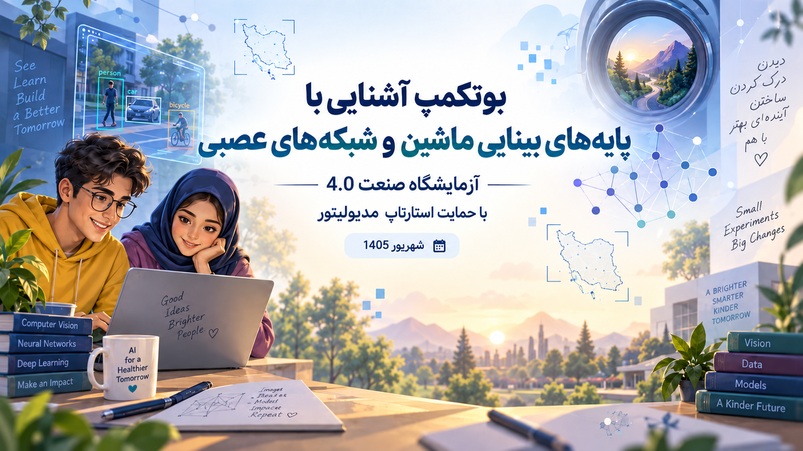
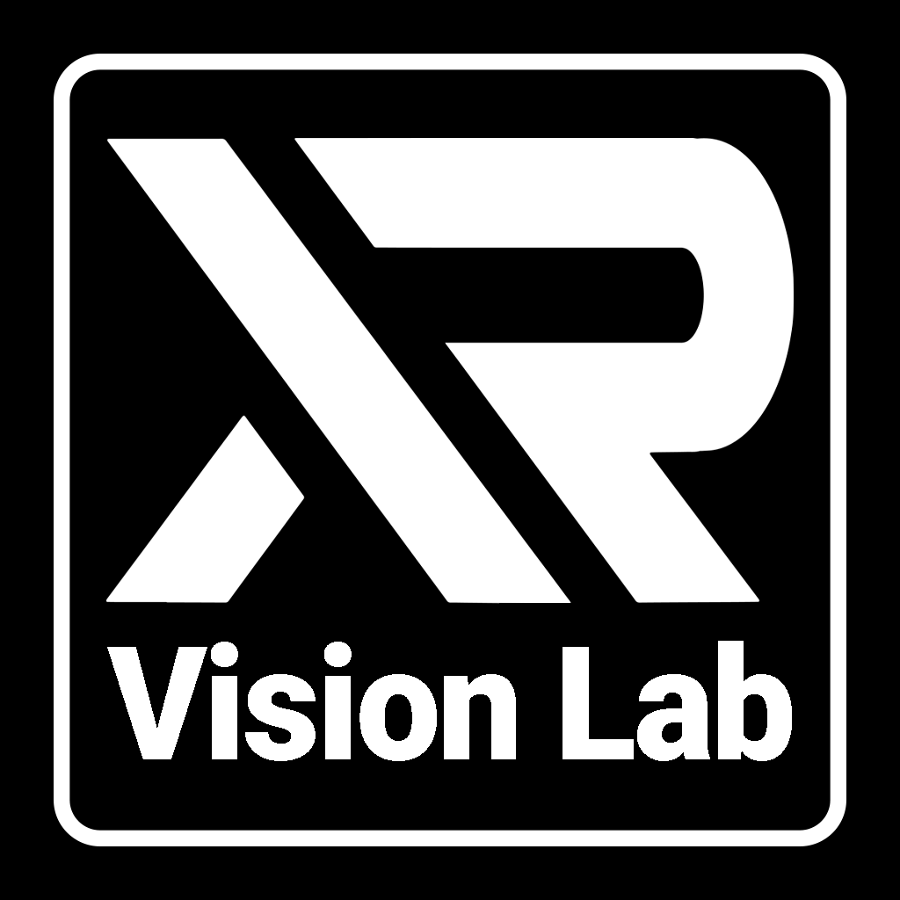
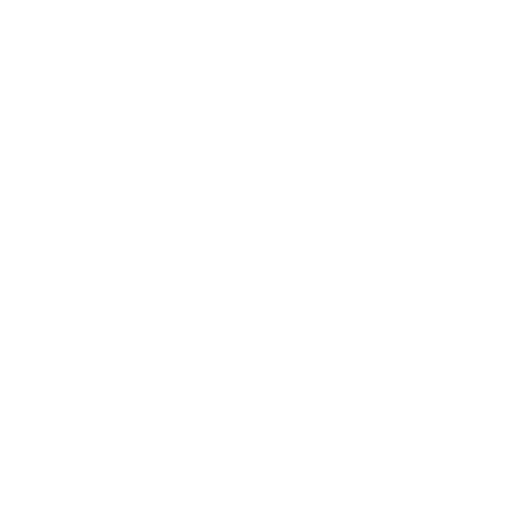

  

# مقدمه 🌱

سلام به شما عزیزهای دل من.

واقعیتش این است که **خود من هم هنوز احساس می‌کنم چیزی سرم نمی‌شود!** 😄  
حدود یک و نیم سال است که در فضای بینایی ماشین، شبکه‌های عصبی و یادگیری عمیق کار می‌کنم؛ در این مدت چیزهای زیادی یاد گرفته‌ام و هم‌زمان بیشتر از قبل فهمیده‌ام که این حوزه چقدر **وسیع، شیرین و پر از چیزهای تازه برای یاد گرفتن** است.

برای همین تصمیم گرفتم شما را هم وارد این فضا کنم؛ شاید حتی کمی بیشتر گیج شوید، اما از آن گیج‌شدن‌هایی که باعث می‌شود بفهمیم هنوز چقدر دنیا برای کشف‌کردن داریم.

یک چیز را هم خیلی زود فهمیدم:  
**این چیزها فقط با خواندن یاد گرفته نمی‌شوند.** باید تمرین کرد، کد زد، خراب کرد، دوباره ساخت، سؤال پرسید، چیز میز خواند و با پروژه‌های واقعی درگیر شد.

هوش و استعداد حتماً کمک می‌کنند، مخصوصاً وقتی پای کدنویسی و اجرای ایده‌ها وسط باشد؛ اما چیزی که واقعاً آدم را جلو می‌برد، **تمرین، استمرار، کنجکاوی و تجربه‌کردن** است.

این بوتکمپ دو جلسه‌ای را برای آدم‌هایی برگزار کردم که واقعاً از ته قلب دوست‌شان دارم و از دیدن رشد و پیشرفت‌شان ذوق می‌کنم.❤️ هدفم فقط این بود که بیشتر با این دنیا آشنا شوید، دست‌به‌کار شوید، تجربه کنید و کم‌کم بتوانید فعالیت‌های جدی، مفید و اثرگذار انجام بدهید.

خوشحالم که بخش کوچکی از چیزهایی را که تا امروز یاد گرفته‌ام، با شما به اشتراک می‌گذارم.  
مطالب این Repository ترکیبی است از **Speech Noteهای خودم** و **جزوه‌ای که دوستان‌مان از جلسات تنظیم کرده‌اند**؛ آن‌ها را کنار هم گذاشته‌ام تا چیزی بماند که بعدها هم بتوان به آن برگشت، از آن ایده گرفت و مسیر را کمی راحت‌تر شروع کرد.

امیدوارم این نوشته‌ها فقط خوانده نشوند؛ **اجرا شوند، تغییر کنند، خراب شوند و دوباره بهتر ساخته شوند.**

ان‌شاءالله خدا جوانی ما را سرشار از **رشد، نشاط، یادگیری، تجربه و اثرگذاری** قرار بدهد. 🌱

---

## 📚 محتوای جلسات

برای دیدن جزئیات هر جلسه، از پوشه‌های زیر شروع کنید:

### 👉 [Session1 — جلسه اول](./Session1/)
مقدمه‌ای بر بینایی ماشین، پردازش تصویر، شبکه‌های عصبی، OpenCV، Motion Detection، YOLO و مفاهیم پایه یادگیری.

### 👉 [Session2 — جلسه دوم](./Session2/)
ادامه مباحث و صحبت در مورد لیبل‌ها، بررسی دیتا و تمرین‌های عملی و آموزش مدل

---

## 🏫 برگزارکنندگان

> 

>   
>   &nbsp;&nbsp;&nbsp;&nbsp;
>   
> 

---

<strong>شهریور ماه ۱۴۰۵</strong>

دوست‌تون دارم؛ خیلی زیاد ❤️🍀

تقدیم می‌کنم این دوره رو به پیامبر رحمت (ص)

