<div dir="rtl">

> به نام خدایی که نسبت محیط به قطر را دقیق می‌داند.

# جلسه اول — مقدمه‌ای بر بینایی ماشین (Computer Vision)
## از پیکسل و لبه تا شبکه عصبی، یادگیری عمیق و YOLO

**گردآورنده: [علی نجارزادگان](https://www.linkedin.com/in/ali-najjarzadegan/)**،
**با همراهی: [نگار عرفانی](https://www.linkedin.com/in/negar-erfani-664910360/)**،

**ویژه دانشجویان XR — دانشگاه صنعتی اصفهان**

---

## درباره این درس‌نامه

این متن نسخه‌ی بازنویسی‌شده، تکمیل‌شده و آموزشی جلسه‌ی اول آشنایی با **بینایی ماشین (Computer Vision)** است. هدف من این نیست که صرفاً مجموعه‌ای از تعریف‌ها، اسلایدها یا نکات پراکنده در اختیار شما قرار بدهم. تلاش کرده‌ام مسیر فکری جلسه را به شکلی بازسازی کنم که اگر کسی در کلاس حضور نداشته باشد نیز بتواند با خواندن این فایل، اجرای تمرین‌ها و بازی‌کردن با پارامترها، منطق موضوع را از پایه درک کند.

در این جلسه عمداً از یک مسیر مشخص حرکت می‌کنیم:

**انسان چگونه می‌بیند؟ → تصویر برای کامپیوتر چیست؟ → پردازش تصویر چیست؟ → لبه و ویژگی چیست؟ → روش‌های کلاسیک چرا محدود شدند؟ → ماشین چگونه یاد می‌گیرد؟ → شبکه عصبی دقیقاً چه می‌کند؟ → CNN چگونه Feature می‌سازد؟ → YOLO چگونه وارد مسئله تشخیص شیء می‌شود؟**

این ترتیب مهم است. اگر مستقیم سراغ اجرای YOLO برویم، احتمالاً می‌توانیم با چند خط کد یک Bounding Box روی تصویر بکشیم؛ اما هنوز نفهمیده‌ایم پشت آن چه اتفاقی افتاده است. هدف این درس‌نامه، عبور از «اجرای دستور» به سمت **فهم مهندسی سیستم** است.

---

# فهرست مطالب

1. بینایی ماشین دقیقاً چه مسئله‌ای را حل می‌کند؟
2. انسان چگونه می‌بیند و چرا لبه‌ها مهم‌اند؟
3. تفاوت Image Processing و Computer Vision
4. تاریخچه: از Summer Vision Project تا Deep Learning
5. کامپیوتر یک تصویر را چگونه می‌بیند؟
6. پردازش تصویر کلاسیک: رنگ، نویز، Threshold و Edge
7. از Motion Detection تا Template Matching
8. Feature چیست و چرا Feature Engineering به وجود آمد؟
9. Classification، Localization، Detection، Segmentation و Tracking
10. Machine Learning و انواع یادگیری
11. شبکه عصبی از پایه: نورون، وزن و زنجیره نورونی
12. شبکه چگونه واقعاً یاد می‌گیرد؟
13. CNN و استخراج سلسله‌مراتبی ویژگی
14. Training، Validation، Test و Generalization
15. Overfitting و Underfitting
16. Transfer Learning، Fine-Tuning و Few/One/Zero-Shot
17. YOLO: از ایده تا اجرای عملی
18. ابزارهای کاری و آماده‌سازی محیط
19. تمرین‌های عملی OpenCV
20. اتصال وب‌کم و دوربین گوشی
21. Motion Detection
22. YOLO روی تصویر و وب‌کم
23. آموزش مدل اختصاصی
24. نگاه مهندسی: چه زمانی AI نیاوریم؟
25. ارتباط Computer Vision با XR
26. خطاهای رایج و Troubleshooting
27. تمرین‌ها و پروژه‌های پیشنهادی
28. واژه‌نامه
29. تصاویر پیشنهادی
30. منابع و جمع‌بندی

---

# 1. بینایی ماشین دقیقاً چه مسئله‌ای را حل می‌کند؟

در ساده‌ترین بیان، **بینایی ماشین تلاش می‌کند از داده‌ی تصویری، اطلاعات قابل استفاده استخراج کند.**

یک دوربین به خودی خود «نمی‌بیند». دوربین نور را دریافت و آن را به مجموعه‌ای از مقادیر عددی تبدیل می‌کند. این اعداد در نهایت برای کامپیوتر چیزی شبیه یک ماتریس بزرگ هستند.

اما ما از یک سیستم بینایی انتظار داریم بتواند به پرسش‌هایی مانند این‌ها پاسخ دهد:

- در تصویر **چه چیزی** وجود دارد؟
- آن شیء **کجا** قرار گرفته است؟
- چند نمونه از آن وجود دارد؟
- مرز دقیق آن کجاست؟
- آیا در حال حرکت است؟
- آیا همان شیئی است که در فریم قبلی دیدیم؟
- فاصله یا عمق تقریبی آن چقدر است؟
- وضعیت یا Pose آن چیست؟
- آیا رفتار یا رخدادی غیرعادی در تصویر دیده می‌شود؟

پس یک خط فکری ساده داریم:

```text
Light
  ↓
Sensor
  ↓
Pixels
  ↓
Processing
  ↓
Features / Representation
  ↓
Model
  ↓
Meaning / Decision
```

---

# 2. انسان چگونه می‌بیند و چرا لبه‌ها مهم‌اند؟

برای فهم بینایی ماشین، شروع از بینایی انسان بسیار کمک‌کننده است. آنچه ما «دیدن» می‌نامیم صرفاً ورود نور به چشم نیست. نور از محیط بازتاب می‌شود، به شبکیه می‌رسد، به سیگنال عصبی تبدیل می‌شود و سپس مغز این سیگنال‌ها را در چندین مرحله پردازش می‌کند.

یکی از نکات مهم این است که در بسیاری از شرایط، **تفاوت‌ها** برای سیستم بینایی مهم‌تر از مقدار مطلق روشنایی هستند. تفاوت در شدت نور، رنگ، بافت، جهت، حرکت و مرز میان نواحی به ما کمک می‌کند اشیا را از محیط جدا کنیم. به همین دلیل مفهوم **Edge یا لبه** بسیار بنیادی است.

فرض کنید یک شیء دقیقاً همرنگ پس‌زمینه باشد، نور و سایه‌ی مشابهی داشته باشد و بافت آن نیز با محیط ادغام شود. تشخیص مرز آن بسیار سخت‌تر می‌شود. منطق استتار نیز تا حد زیادی از همین موضوع استفاده می‌کند: کم‌کردن نشانه‌های بصری‌ای که مرز یک شیء را آشکار می‌کنند.

> **نکته مهم:** مغز فقط «لبه» نمی‌بیند و بینایی انسان بسیار پیچیده‌تر از Edge Detection است؛ اما حساسیت به کنتراست، جهت لبه، حرکت و ساختارهای محلی یکی از پایه‌های مهم پردازش بصری است.

در قشر بینایی اولیه یا **V1**، گروه‌هایی از نورون‌ها نسبت به ویژگی‌هایی مثل جهت خطوط و لبه‌ها حساس‌اند. در CNNها نیز لایه‌های ابتدایی معمولاً الگوهای ساده‌تری مانند لبه، جهت، کنتراست و Textureهای ابتدایی را بازنمایی می‌کنند و با عمیق‌تر شدن شبکه، بازنمایی‌ها پیچیده‌تر می‌شوند.

> [!TIP]
> همچنین بیشتر بخوانید در
> https://www.ophthalmologytraining.com/core-principles/ocular-anatomy/visual-pathway

<p align="center">
  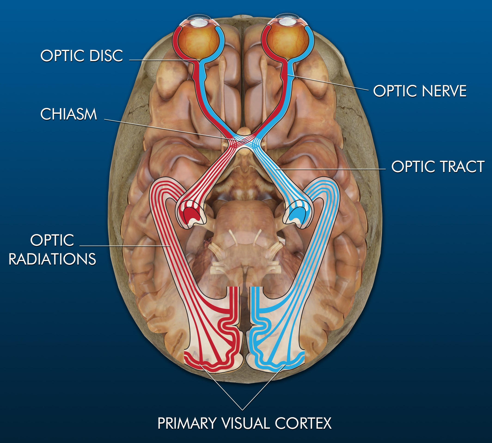
</p>
<p align="center">
  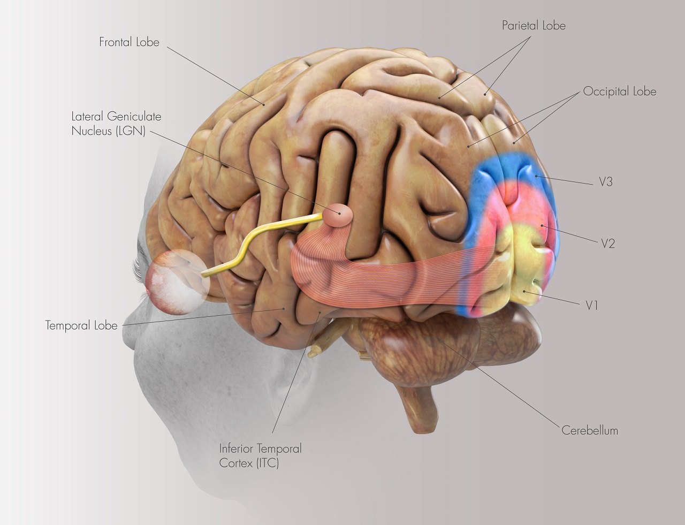
</p>

---

# 3. تفاوت Image Processing و Computer Vision

در **پردازش تصویر** تمرکز عمدتاً روی خود داده‌ی تصویری است: روشن‌کردن تصویر، کاهش نویز، Grayscale، تغییر کنتراست، استخراج لبه، ساخت ماسک، Resize و Rotate.

در **بینایی ماشین** هدف اصلی استخراج اطلاعات و معنا از تصویر است؛ مثلاً سیستم بگوید «در تصویر یک انسان وجود دارد»، «این شیء یک کلاه ایمنی است» یا «این جسم همان جسمی است که در فریم قبلی دیده شد».

| پرسش | حوزه غالب |
|---|---|
| چطور Noise تصویر را کم کنم؟ | Image Processing |
| چطور تصویر را Gray کنم؟ | Image Processing |
| چطور لبه‌ها را پیدا کنم؟ | Image Processing |
| این شیء چیست؟ | Computer Vision |
| این شیء کجاست؟ | Computer Vision |
| چند نفر در تصویر هستند؟ | Computer Vision |
| این پیکسل‌ها متعلق به کدام شیء هستند؟ | Computer Vision |

### آیا هر سیستم CV حتماً ابتدا Canny و Threshold اجرا می‌کند؟

خیر. در سیستم‌های کلاسیک، Pipeline اغلب به صورت صریح شامل preprocessing و feature extraction بود. در Deep Learning مدرن، شبکه می‌تواند بسیاری از featureها را مستقیماً از داده یاد بگیرد. با این حال پردازش تصویر همچنان برای آماده‌سازی داده، اصلاح نور، Resize، Normalization، حذف نویز، ساخت Mask و کنترل کیفیت ورودی مهم است.

---

# 4. تاریخچه: از Summer Vision Project تا Deep Learning

## 1963 — Larry Roberts و Block World

یکی از کارهای اولیه و مهم، تلاش برای استخراج اطلاعات سه‌بعدی از تصاویر دوبعدی اجسام ساده و چندوجهی بود. سؤال بنیادین این بود: آیا می‌توان از روی تصویر دوبعدی، ساختار جهان را استنباط کرد؟

## 1966 — MIT Summer Vision Project

در MIT پروژه‌ای تعریف شد تا گروهی از دانشجویان طی تابستان بخش قابل توجهی از یک سیستم بینایی را پیاده‌سازی کنند. این پروژه امروز مثال کلاسیکی از این واقعیت است که مسئله «دیدن» برای ماشین بسیار دشوارتر از تصور اولیه بود.

## دوران کلاسیک

در نبود قدرت محاسباتی و داده‌های عظیم امروزی، پژوهشگران بیشتر سراغ روش‌هایی رفتند که انسان ویژگی‌ها را طراحی می‌کرد: Edge Detection، Corners، Template Matching، SIFT، HOG و Haar-like Features.

## 1986 — Canny

Canny به یکی از مشهورترین روش‌های تشخیص لبه تبدیل شد و هنوز هم در پروژه‌های واقعی استفاده می‌شود.

## 1991 — Eigenfaces

استفاده از روش‌های آماری برای نمایش چهره، گامی مهم در Face Recognition کلاسیک بود.

## 2001 — Viola–Jones

تشخیص سریع چهره با Haar-like features و cascade classifier، امکان Face Detection بلادرنگ روی سخت‌افزارهای آن دوره را فراهم کرد.

## 2009 — ImageNet

وجود یک مجموعه‌داده بسیار بزرگ از تصاویر برچسب‌خورده، بستر مهمی برای جهش بعدی فراهم کرد.

## 2012 — AlexNet

AlexNet نشان داد که ترکیب شبکه عصبی عمیق، GPU، داده زیاد و آموزش مناسب می‌تواند عملکرد چشمگیری در تشخیص تصویر ایجاد کند.

## 2014–2015 — R-CNN Family

خانواده R-CNN نقش مهمی در Object Detection مبتنی بر Deep Learning داشت.

## 2015 — YOLO

نسخه اولیه مقاله YOLO در سال 2015 منتشر شد و نسخه کنفرانسی آن در CVPR 2016 ارائه شد. ایده کلیدی این بود که Detection تا حد امکان به شکل یک مدل یکپارچه و end-to-end حل شود.

<p align="center">
  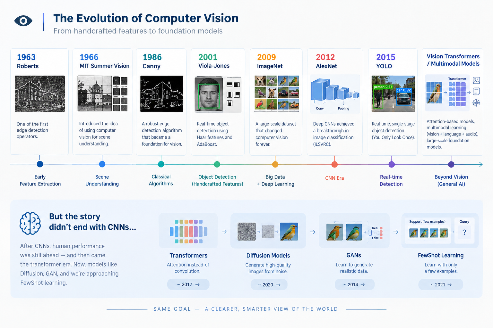
</p>

> [!TIP]
> البته جالب است بدانید که دانشمندان، هیچ گاه متوقف نشدند و هر جایی به بهبود شبکه عصبی و نزدیک‌تر شدن به سیستم بینایی قدرتمند انسان، پژوهش می‌کنند. برای مثال، هرگاه مقالات علوم شناختی تخصصی مغز و اعصاب برگزار شده، سال بعدی آن، مقالات بهبود یافته سیستم هوش مصنوعی نیز به همان میزان گسترش یافته و فهم ما را به‌روزتر کرده.

---

# 5. کامپیوتر یک تصویر را چگونه می‌بیند؟

برای انسان، تصویر می‌تواند «یک میز، یک گربه و یک لیوان» باشد. برای کامپیوتر، در سطح خام، تصویر مجموعه‌ای از عددهاست.

## تصویر Grayscale

```text
[
  [ 12,  18,  30,  29 ],
  [ 11,  20,  90, 100 ],
  [ 10,  15, 180, 220 ]
]
```

در تصویر 8-bit، مقدار 0 معمولاً سیاه و 255 سفید است.

## تصویر رنگی

در RGB هر Pixel سه مؤلفه دارد، اما OpenCV به‌صورت پیش‌فرض تصویر را با ترتیب **BGR** می‌خواند.

```python
import cv2
img = cv2.imread("test.jpg")
print(img.shape)
```

خروجی مثلاً:

```text
(1080, 1920, 3)
```

## چرا Grayscale؟

اگر رنگ برای مسئله اهمیت زیادی نداشته باشد، یک کانال به جای سه کانال می‌تواند محاسبات را ساده‌تر کند. تبدیل استاندارد رنگ به Gray صرفاً «میانگین ساده سه کانال» نیست و معمولاً وزن ادراکی متفاوتی برای کانال‌ها در نظر گرفته می‌شود.

---

# 6. پردازش تصویر کلاسیک: رنگ، نویز، Threshold و Edge

## Color Spaces

فضاهای رایج: RGB/BGR، HSV، LAB و Grayscale. HSV در بسیاری از مسائل جداسازی بر اساس رنگ مفید است.

```python
hsv = cv2.cvtColor(img, cv2.COLOR_BGR2HSV)
```

## Noise Reduction

```python
blurred = cv2.GaussianBlur(img, (5, 5), 0)
median = cv2.medianBlur(img, 5)
```

## Threshold

```python
_, binary = cv2.threshold(gray, 127, 255, cv2.THRESH_BINARY)
```

در تصاویر واقعی، روش‌هایی مثل Otsu و Adaptive Thresholding نیز مفیدند.

## Canny Edge Detection

```python
edges = cv2.Canny(gray, 100, 200)
```

Canny به شکل ساده شامل کاهش نویز، محاسبه Gradient، نازک‌کردن لبه، اعمال دو Threshold و دنبال‌کردن لبه‌های معتبر است.

### تمرین

```python
cv2.Canny(gray, 20, 60)
cv2.Canny(gray, 50, 150)
cv2.Canny(gray, 100, 200)
cv2.Canny(gray, 200, 250)
```

تغییر خروجی را با Thresholdهای مختلف بررسی کنید.

<p align="center">
  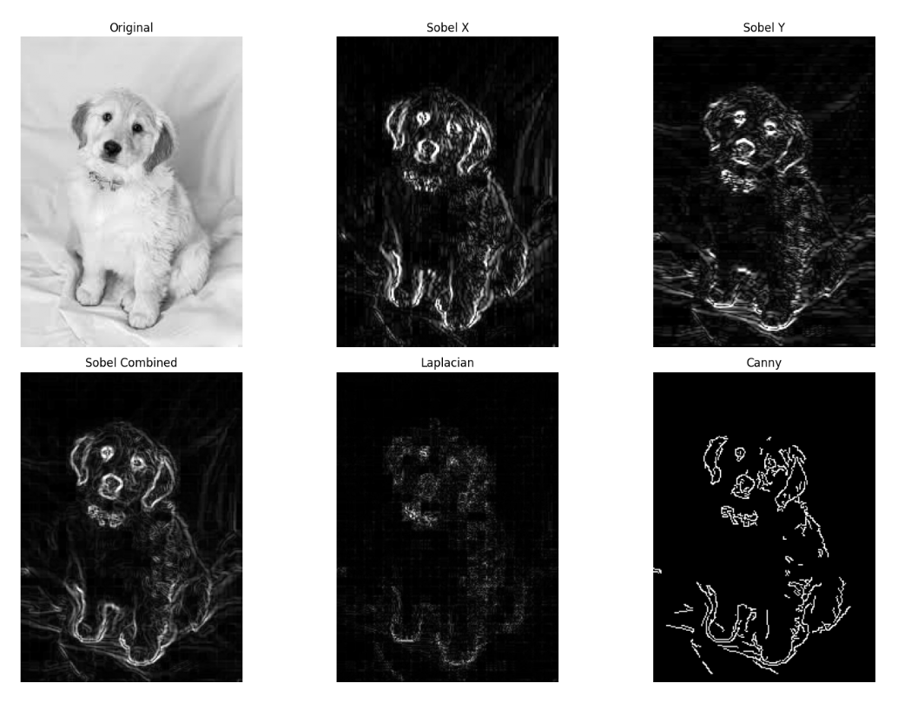
</p>
<p align="center">
  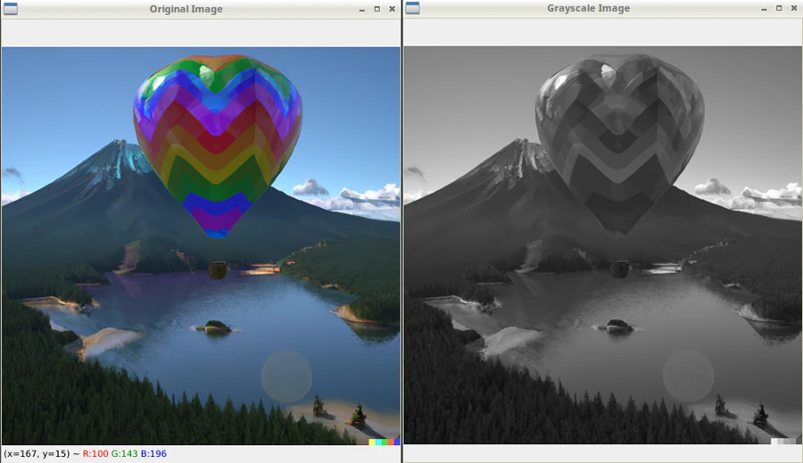
</p>
<p align="center">
  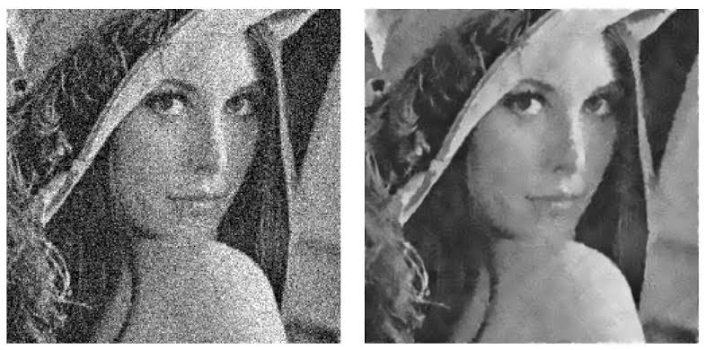
</p>

---

# 7. از Motion Detection تا Template Matching

## Motion Detection

ساده‌ترین ایده این است:

```text
Difference = |Frame(t+1) - Frame(t)|
```

اگر تعداد زیادی Pixel تغییر کند، احتمالاً حرکتی رخ داده است.

## Background Subtraction

```python
back_sub = cv2.createBackgroundSubtractorMOG2()
mask = back_sub.apply(frame)
```

## Template Matching (شابلون)

```python
result = cv2.matchTemplate(image, template, cv2.TM_CCOEFF_NORMED)
```

مشکل اصلی Template Matching ساده این است که با Rotation، Scale، تغییر نور و Occlusion شکننده می‌شود. پس مجبور می‌شویم Templateهای بیشتر و Ruleهای بیشتری اضافه کنیم.

> [!IMPORTANT]
> روش کلاسیک بد نیست. اگر محیط کنترل‌شده، ثابت، قابل پیش‌بینی و مسئله محدود باشد، الگوریتم کلاسیک ممکن است ساده‌تر، سریع‌تر، ارزان‌تر و قابل توضیح‌تر از یک شبکه عصبی بزرگ باشد. گاهی لازم نیست کار پیچیده انجام دهیم، همان شایلون‌های سرچ ساده، می‌تواند جواب دهد و هزینه‌ها را کاهش دهد.

> [!NOTE]
> از جاهایی که موشن دیتکشن خیلی به کمک می‌آید، در ذخیره‌سازی بهینه تصاویر دوربین‌های مدار بسته است. این شیوه، موجب می‌شود در صورتی که تغییراتی سیستم حس کرد، از چند ثانیه قبلش که در بافر نرم افزاری موجود است را شروع به ذخیره کند و تا پایان این حرکت‌ها، حافظه را اشغال کند. این موضوع موجب افزایش زمان ذخیره باشد. البته می‌دانیم ابراداتی هم دارد و مثلا، اگر آن واقعه، از ترشولد اختلاف فریم کمتر باشد، ممکن است ذخیره نشود!!!!
---

# 8. Feature چیست و چرا Feature Engineering به وجود آمد؟

Feature یعنی بازنمایی یا مشخصه‌ای که برای حل Task مفید است. برای یک خودکار ممکن است طول، نسبت طول به عرض، شکل سر یا الگوهای لبه مفید باشند.

در روش‌های کلاسیک، مهندس Feature را طراحی می‌کرد:

```text
Edge orientation
Corner count
Shape descriptor
Histogram
Texture
Distance between landmarks
```

نمونه‌های معروف Hand-crafted Features:

- SIFT
- ORB
- HOG

اما تعریف دستی تمام Featureهای یک «گربه» در تمام زاویه‌ها، نورها و حالت‌ها بسیار دشوار است. همین موضوع یکی از انگیزه‌های اصلی Deep Learning شد:

> به جای اینکه همه Featureها را خودمان طراحی کنیم، اجازه دهیم مدل از داده یاد بگیرد چه Representationهایی برای حل مسئله مفیدند.

---

# 9. Classification، Localization، Detection، Segmentation و Tracking

- **Classification:** این تصویر چیست؟
- **Localization:** شیء کجاست؟
- **Object Detection:** چه اشیایی و در کجا هستند؟
- **Semantic Segmentation:** هر Pixel متعلق به کدام Class است؟
- **Instance Segmentation:** هر نمونه مستقل از یک Class کدام Pixelها را دارد؟
- **Tracking:** آیا این Object همان Object فریم قبلی است؟

<p align="center">
  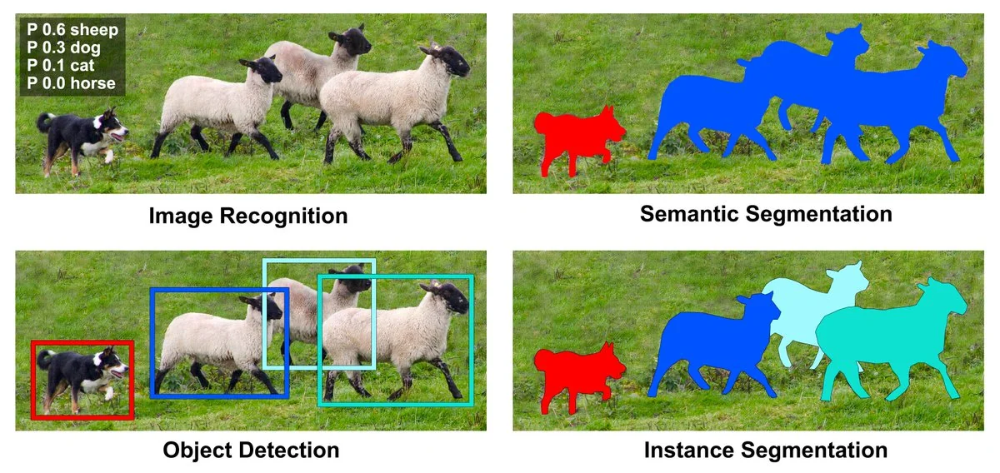
</p>
<p align="center">
  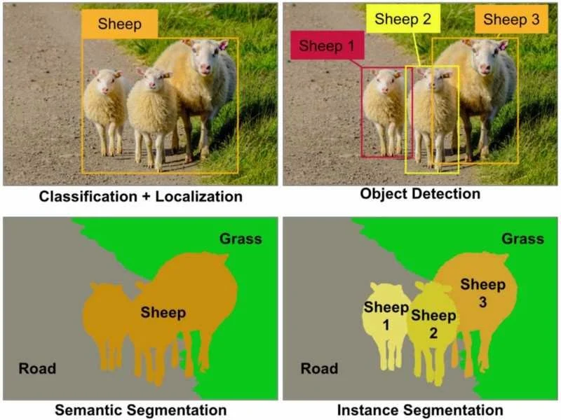
</p>

---
# 10. Machine Learning و انواع یادگیری

## Supervised Learning

داده همراه Label داریم. برای مثال:

```text
image_001.jpg → cat
image_002.jpg → dog
```

یا در Object Detection، برای هر تصویر Class و Bounding Boxهای Ground Truth داریم.

## Unsupervised Learning

Label صریح نداریم و مدل تلاش می‌کند ساختار موجود در داده را پیدا کند. یکی از نمونه‌های شناخته‌شده، **Clustering** است.

> نکته: Regression معمولی غالباً یک مسئله Supervised است، چون Target عددی مشخص داریم.

## Self-Supervised Learning

مدل از خود داده یک مسئله آموزشی می‌سازد و بدون Label دستی گسترده، Representation یاد می‌گیرد. این رویکرد در مدل‌های مدرن بسیار مهم شده است.

## Reinforcement Learning

در Reinforcement Learning یک **Agent** با یک **Environment** تعامل می‌کند. Agent Action انجام می‌دهد، Observation جدید می‌گیرد، Reward دریافت می‌کند و تلاش می‌کند Policy بهتری یاد بگیرد.

مثال رانندگی:

```text
Observation:
    وضعیت مسیر، سرعت، موقعیت

Actions:
    steering
    throttle
    brake

Reward:
    حرکت صحیح، برخورد نکردن، رسیدن به مقصد
```

نکته اصلی RL این نیست که «هیچ داده اولیه‌ای وجود ندارد»؛ تفاوت بنیادی این است که سیگنال یادگیری عمدتاً از **تعامل و Reward** می‌آید.

---

# 11. شبکه عصبی از پایه: نورون، وزن و زنجیره نورونی

شبکه عصبی را نباید به‌عنوان یک جعبه جادویی دید.

## 11.1 یک نورون مصنوعی چه می‌کند؟

فرض کنید ورودی‌ها این‌ها باشند:

```text
x1, x2, x3
```

هر اتصال یک Weight دارد:

```text
w1, w2, w3
```

نورون ابتدا یک جمع وزن‌دار می‌سازد:

```text
z = x1*w1 + x2*w2 + x3*w3 + b
```

که `b` همان Bias است. سپس نتیجه از Activation Function عبور می‌کند:

```text
a = activation(z)
```

مثلاً ReLU:

```text
ReLU(z) = max(0, z)
```

پس نورون در اصل یک واحد محاسباتی است، نه موجودی که به تنهایی «فهم» داشته باشد.

## 11.2 پس قدرت شبکه از کجا می‌آید؟

از **اتصال تعداد زیادی تبدیل ساده**.

```text
Input
  ↓
Layer 1
  ↓
Layer 2
  ↓
Layer 3
  ↓
...
  ↓
Output
```

هر واحد خروجی خود را به واحدهای بعدی می‌دهد. چیزی که میان این واحدها اهمیت حیاتی دارد، **وزن اتصال‌ها** است.

در قیاس زیستی، سیناپس‌ها شدت اثر یک نورون بر نورون دیگر را تغییر می‌دهند. در شبکه مصنوعی نیز Weight تعیین می‌کند یک سیگنال چقدر بر محاسبه بعدی اثر بگذارد.

> **یادگیری شبکه، تا حد زیادی یعنی تنظیم همین وزن‌ها به‌گونه‌ای که تبدیل زنجیره‌ای ورودی به خروجی، پاسخ بهتری تولید کند.**

## 11.3 مثال عددی کوچک

فرض کنید:

```text
x1 = 2
x2 = 3

w1 = 0.5
w2 = -0.25
b  = 1
```

پس:

```text
z = 2(0.5) + 3(-0.25) + 1
z = 1 - 0.75 + 1
z = 1.25
```

اگر ReLU داشته باشیم:

```text
a = 1.25
```

اگر یکی از Weightها تغییر کند، خروجی نیز تغییر می‌کند. این یعنی شبکه می‌تواند با تنظیم وزن‌ها، رفتار خود را تغییر دهد.

## 11.4 چرا چند لایه؟

وقتی لایه‌ها پشت سر هم قرار می‌گیرند، هر لایه می‌تواند خروجی لایه قبلی را دوباره ترکیب کند.

برای تصویر، می‌توان شهودی تصور کرد:

```text
Pixels
  ↓
Edges
  ↓
Simple patterns
  ↓
Textures / Shapes
  ↓
Parts
  ↓
Object-level representation
```

این یک ساده‌سازی آموزشی است؛ در شبکه واقعی، Featureها همیشه این‌قدر تمیز و قابل نام‌گذاری نیستند.

## 11.5 «درک» در شبکه یعنی چه؟

وقتی می‌گوییم مدل «گربه را فهمیده»، نباید آن را دقیقاً معادل فهم انسانی بگیریم. مدل یک **Representation عددی** می‌سازد که برای Classification یا Detection مفید است.

در زبان مهندسی بهتر است بگوییم:

> مدل Representationهایی یاد گرفته است که امکان تفکیک یا پیش‌بینی مناسب را فراهم می‌کنند.

<p align="center">
  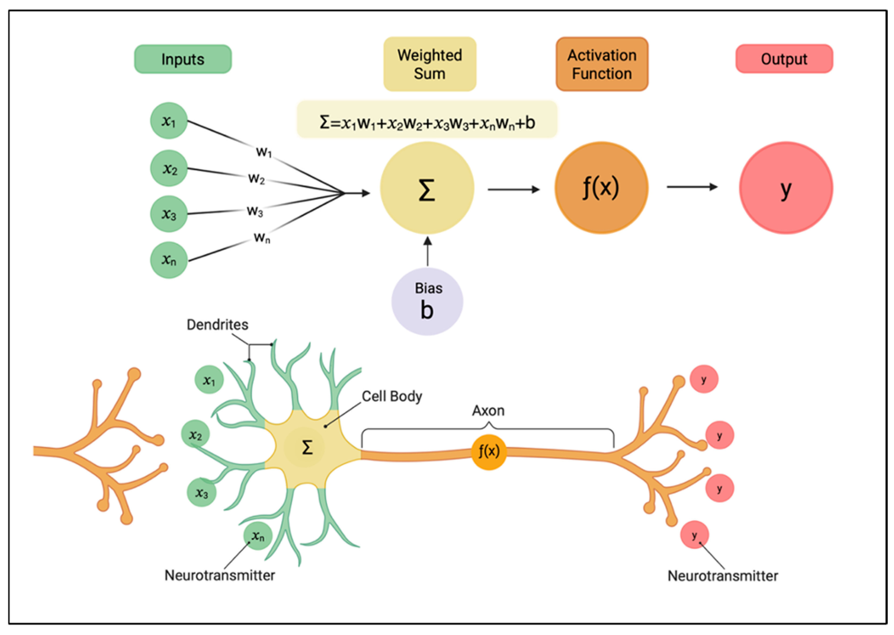
</p>

<p align="center">
  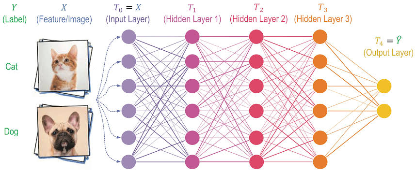
</p>

---

# 12. شبکه چگونه واقعاً یاد می‌گیرد؟

چهار مفهوم باید به هم وصل شوند:

```text
Forward Pass
    ↓
Prediction
    ↓
Loss
    ↓
Backpropagation
    ↓
Gradient
    ↓
Optimizer
    ↓
Updated Weights
```

و این چرخه بارها تکرار می‌شود.

## 12.1 Forward Pass

ورودی از تمام لایه‌ها عبور می‌کند:

```text
x → Layer1 → Layer2 → Layer3 → y_hat
```

`y_hat` پیش‌بینی مدل است.

## 12.2 Loss Function

Loss یک عدد تولید می‌کند که میزان خطا را با توجه به Objective آموزشی اندازه می‌گیرد.

## 12.3 Backpropagation

سؤال اصلی:

> کدام Weightها چقدر در خطا سهم داشته‌اند و اگر کمی تغییر کنند، Loss چه تغییری می‌کند؟

اگر شبکه را یک زنجیره بدانیم:

```text
x → f1 → f2 → f3 → Loss
```

با استفاده از مشتق و **Chain Rule** می‌توان اثر پارامترهای لایه‌های قبلی بر Loss نهایی را محاسبه کرد.

به زبان ساده:

```text
Loss
  ↓
برای کم شدن من، خروجی آخر چقدر باید تغییر کند؟
  ↓
برای تغییر خروجی آخر، پارامترهای لایه قبل چقدر باید تغییر کنند؟
  ↓
و لایه قبل از آن؟
  ↓
...
```

این همان منطق Backpropagation است.

## 12.4 Gradient

Gradient جهت حساسیت Loss به هر Parameter را نشان می‌دهد.

قاعده ساده Gradient Descent:

```text
new_weight = old_weight - learning_rate * gradient
```

## 12.5 Learning Rate

Learning Rate مشخص می‌کند در هر Update چقدر حرکت کنیم. مقدار خیلی بزرگ می‌تواند Training را ناپایدار کند و مقدار خیلی کوچک Training را کند می‌کند.

## 12.6 Optimizer

Optimizer الگوریتمی است که با استفاده از Gradient، Parameterها را Update می‌کند. نمونه‌ها:

- SGD
- SGD + Momentum
- Adam
- AdamW

## 12.7 Epoch و Batch

اگر کل Train Dataset یک بار در فرایند Training مصرف شود، معمولاً می‌گوییم یک **Epoch** طی شده است.

داده‌ها معمولاً به Batchهای کوچک‌تر تقسیم می‌شوند:

## 12.8 چرا شبکه Feature یاد می‌گیرد؟

در شروع Training، Weightها هنوز برای Task تخصصی نشده‌اند. با تکرار:

```text
Input
→ Prediction
→ Error
→ Gradient
→ Weight Update
```

پارامترها به سمت مقادیری حرکت می‌کنند که Loss را کاهش دهند. در CNN این فرایند باعث می‌شود Filterها و لایه‌های بعدی Representationهایی بسازند که برای Task مفیدترند.

> **کل شبکه از طریق تنظیم پیوسته روابط و وزن‌های بین تعداد بسیار زیادی واحد محاسباتی، یک نگاشت مفید از داده ورودی به خروجی می‌سازد.**

این همان نکته کلیدی درباره **زنجیره‌های نورونی** است: «یادگیری» در یک Node منفرد قرار ندارد؛ در ساختار شبکه، پارامترها، مسیرهای محاسباتی و تنظیم ارتباط‌ها پخش شده است.

## 12.9 یک شبکه کوچک با PyTorch

```python
import torch
import torch.nn as nn
import torch.optim as optim

# هدف: تقریب رابطه y = 2x
x = torch.tensor([[1.0], [2.0], [3.0], [4.0]])
y = torch.tensor([[2.0], [4.0], [6.0], [8.0]])

model = nn.Linear(1, 1)
loss_fn = nn.MSELoss()
optimizer = optim.SGD(model.parameters(), lr=0.01)

for epoch in range(1000):
    y_pred = model(x)          # Forward
    loss = loss_fn(y_pred, y) # Loss

    optimizer.zero_grad()
    loss.backward()           # Backprop
    optimizer.step()          # Update

print("Learned weight:", model.weight.item())
print("Learned bias:", model.bias.item())
print("Prediction x=5:", model(torch.tensor([[5.0]])).item())
```

اگر Training خوب پیش برود، Weight باید به عددی نزدیک 2 برسد.
---

# 13. CNN و استخراج سلسله‌مراتبی ویژگی

CNN یا **Convolutional Neural Network** برای داده‌های مکانی مانند تصویر بسیار مناسب است.

## 13.1 Convolution چیست؟

یک Kernel کوچک روی تصویر حرکت می‌کند. مثلاً Kernel با ابعاد `3×3`. در هر موقعیت، محاسبه‌ای روی ناحیه محلی انجام می‌شود.

در شبکه عصبی، Weightهای Kernel قابل یادگیری‌اند.

## 13.2 Feature Map

خروجی Convolution یک Feature Map است. Feature Map می‌تواند به الگوهایی مثل لبه، Texture، شکل یا ترکیب‌های پیچیده‌تر پاسخ دهد.

## 13.3 عمق شبکه

به صورت شهودی:

```text
Early Layers:
    edges / simple gradients

Middle Layers:
    textures / curves / patterns

Deeper Layers:
    combinations / parts / semantic representations
```

این توصیف آموزشی است و هر Channel لزوماً مفهوم قابل نام‌گذاری انسانی ندارد.

> [!TIP]
> همچنین ببینید:
> https://blog.stackademic.com/ml-series-a-practical-tutorial-on-building-a-convolutional-neural-network-cnn-36443b30b6cf

<p align="center">
  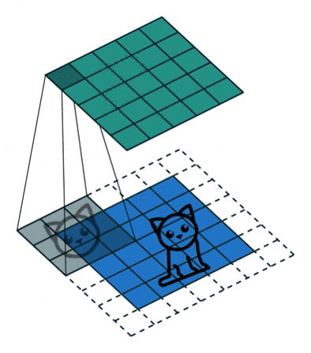
</p>
<p align="center">
  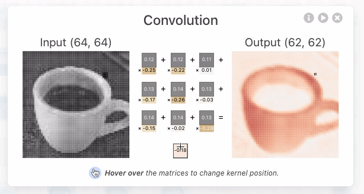
</p>
<p align="center">
  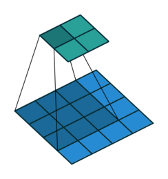
</p>

## 13.4 CNN کوچک با PyTorch

```python
import torch
import torch.nn as nn

class TinyCNN(nn.Module):
    def __init__(self, num_classes=2):
        super().__init__()

        self.features = nn.Sequential(
            nn.Conv2d(3, 16, kernel_size=3, padding=1),
            nn.ReLU(),
            nn.MaxPool2d(2),

            nn.Conv2d(16, 32, kernel_size=3, padding=1),
            nn.ReLU(),
            nn.MaxPool2d(2),
        )

        self.classifier = nn.Sequential(
            nn.Flatten(),
            nn.Linear(32 * 56 * 56, 128),
            nn.ReLU(),
            nn.Linear(128, num_classes)
        )

    def forward(self, x):
        x = self.features(x)
        x = self.classifier(x)
        return x

model = TinyCNN(num_classes=2)
dummy = torch.randn(1, 3, 224, 224)
output = model(dummy)
print(output.shape)
```
---

# 14. Overfitting و Underfitting

## Underfitting

مدل آن‌قدر ساده است یا آن‌قدر کم/بد آموزش دیده که حتی الگوی اصلی را هم خوب یاد نگرفته است.

نشانه ساده:

```text
Train performance: bad
Validation performance: bad
```

## Overfitting

مدل روی Train بسیار خوب است ولی روی داده جدید ضعیف می‌شود.
بگذارید راحت بگویم: مدل، حفظ کرده و دیگر جنرال فعالیت نمی‌کند و مانند کنکوری‌ها، فقط سوالاتی که که قبلا حل کرده باشد را به خوبی جواب می‌دهد، ولی سوال جدید را خیر!


```text
Train performance: excellent
Validation performance: poor
```

> Overfitting صرفاً به معنی «داده خیلی زیاد» نیست. داده‌ی **متنوع و باکیفیت بیشتر** معمولاً به کاهش Overfitting کمک می‌کند.

راه‌های مقابله:

- داده بیشتر و متنوع‌تر
- Data Augmentation
- Regularization
- کاهش ظرفیت مدل
- Early Stopping
- Dataset Split صحیح
- Transfer Learning مناسب

<p align="center">
  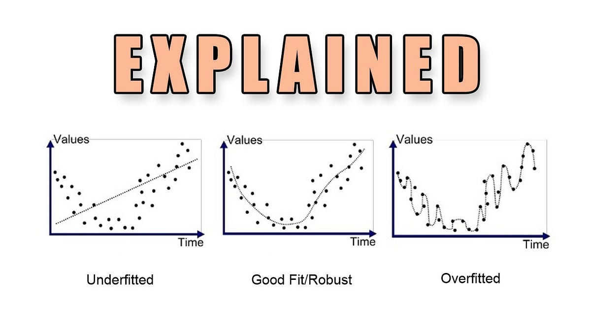
</p>

---

# 15. Transfer Learning، Fine-Tuning, fewShot

## Pretrained Model

به جای آموزش از صفر، از مدلی استفاده می‌کنیم که قبلاً روی Dataset بزرگ آموزش دیده است.

## Transfer Learning

Representationهای قبلی را برای مسئله جدید استفاده می‌کنیم.

## Fine-Tuning

Weightهای مدل Pretrained را با Dataset اختصاصی خودمان بیشتر آموزش می‌دهیم.

## Few-Shot

مدل با تعداد کمی نمونه برای Task جدید تطبیق پیدا می‌کند.


---
# 16. YOLO: از ایده تا اجرای عملی

YOLO مخفف **You Only Look Once** است.

ایده اصلی نسخه‌های اولیه این خانواده این بود که Detection را تا حد زیادی به صورت یک مسئله یکپارچه اجرا کنند و شبکه مستقیماً از تصویر به Bounding Box و Class Prediction برسد.

## چرا YOLO مهم شد؟

برای کاربردهایی مثل دوربین، رباتیک، XR، سیستم‌های تعاملی و پایش صنعتی، **Latency** مهم است. Detector سریع می‌تواند روی Stream تصویر بارها در ثانیه اجرا شود.

## خروجی Detection

برای هر Detection معمولاً داده‌هایی از این جنس داریم:

```text
class
confidence
x1, y1, x2, y2
```

## Confidence

Confidence یک Score مدل برای Detection است و نباید آن را با «قطعیت انسانی» یکی گرفت.

## IoU

```text
IoU = Area of Intersection / Area of Union
```
<p align="center">
  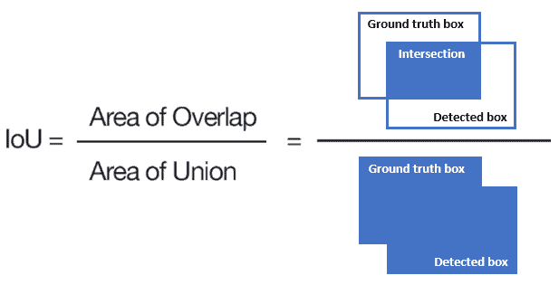
</p>

اگر Bounding Box پیش‌بینی‌شده و Ground Truth تقریباً روی هم باشند، IoU بالا می‌شود.

## NMS

گاهی مدل چند Box نزدیک برای یک شیء پیشنهاد می‌کند. **Non-Max Suppression** برای حذف Detectionهای تکراری/هم‌پوشان استفاده می‌شود.

<p align="center">
  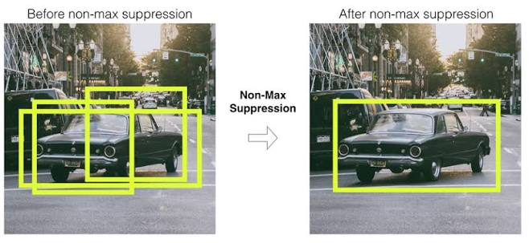
</p>

---

# 17. ابزارهای کاری و آماده‌سازی محیط

| ابزار | نقش |
|---|---|
| Python | زبان اصلی |
| pip | نصب Package |
| venv | ایزوله‌کردن Packageهای پروژه |
| NumPy | محاسبات آرایه‌ای |
| OpenCV | پردازش تصویر و Camera I/O |
| PyTorch | شبکه عصبی و Deep Learning |
| Ultralytics | اجرای ساده خانواده YOLO |
| VSCode / PyCharm / Cursor | توسعه کد |
| Jupyter | آزمایش تعاملی |
| Iriun / DroidCam | استفاده از موبایل به عنوان Camera |
| CVAT / Roboflow / LabelImg / Lable Studio | Annotation |
| Google Colab | اجرای ابری و GPU |
| Kaggle | Dataset و Notebook / Compute |

## نکته درباره venv

`venv` وابستگی‌های Package را ایزوله می‌کند، اما معمولاً **نسخه متفاوت Python را خودش نصب یا مدیریت نمی‌کند**. برای مدیریت چند Python Interpreter می‌توان از ابزارهایی مثل pyenv، conda یا uv استفاده کرد.

## Windows / PowerShell

```powershell
python -m venv cv_env
.\cv_env\Scripts\Activate.ps1

python -m pip install --upgrade pip
pip install opencv-python numpy matplotlib ultralytics
```

خروج:

```powershell
deactivate
```

اگر PowerShell اجازه Activate نداد، می‌توانید در Command Prompt از این استفاده کنید:

```cmd
cv_env\Scripts\activate.bat
```

## Linux / macOS

```bash
python3 -m venv cv_env
source cv_env/bin/activate

python -m pip install --upgrade pip
pip install opencv-python numpy matplotlib ultralytics
```

## تست نصب (یه کد پایتون ساده)

```python
import cv2
import numpy as np

print("OpenCV:", cv2.__version__)
print("NumPy:", np.__version__)
```

## CUDA و GPU

اگر کارت NVIDIA و Stack مناسب CUDA در دسترس باشد، PyTorch و مدل‌های Deep Learning می‌توانند بسیاری از محاسبات را روی GPU اجرا کنند. در نبود GPU محلی، Google Colab یا Kaggle Notebook گزینه‌های کاربردی‌اند.

---

# 18. تمرین عملی ۱: OpenCV و Canny

یک تصویر با نام `test.jpg` کنار فایل Python قرار دهید.

```python
import cv2

img = cv2.imread("test.jpg")

if img is None:
    raise FileNotFoundError("test.jpg پیدا نشد.")

gray = cv2.cvtColor(img, cv2.COLOR_BGR2GRAY)
blur = cv2.GaussianBlur(gray, (5, 5), 0)
edges = cv2.Canny(blur, 100, 200)

cv2.imshow("Original", img)
cv2.imshow("Gray", gray)
cv2.imshow("Blur", blur)
cv2.imshow("Edges", edges)

cv2.waitKey(0)
cv2.destroyAllWindows()
```

### تمرین

سه چیز را تغییر دهید:

1. Kernel مربوط به Gaussian Blur؛
2. Threshold پایین Canny؛
3. Threshold بالای Canny.

نتایج را ذخیره و مقایسه کنید.

## ذخیره خروجی

```python
import cv2

img = cv2.imread("test.jpg")
gray = cv2.cvtColor(img, cv2.COLOR_BGR2GRAY)
edges = cv2.Canny(gray, 100, 200)

cv2.imwrite("gray.jpg", gray)
cv2.imwrite("edges.jpg", edges)
```

---

# 19. تمرین عملی ۲: وب‌کم و دوربین گوشی

## وب‌کم لپ‌تاپ

```python
import cv2

cap = cv2.VideoCapture(0)

if not cap.isOpened():
    raise RuntimeError("Camera could not be opened.")

while True:
    ret, frame = cap.read()

    if not ret:
        break

    cv2.imshow("Live Camera", frame)

    if cv2.waitKey(1) & 0xFF == ord("q"):
        break

cap.release()
cv2.destroyAllWindows()
```

## پیدا کردن Camera Index

```python
import cv2

for index in range(10):
    cap = cv2.VideoCapture(index)

    if cap.isOpened():
        ret, frame = cap.read()
        if ret:
            print(f"Camera index {index} is available")

    cap.release()
```

ترتیب Indexها تضمین‌شده نیست؛ ممکن است 0 وب‌کم داخلی، 1 دوربین مجازی و 2 دوربین موبایل باشد یا کاملاً متفاوت باشد.

## Iriun / DroidCam

روال کلی:

1. Client را روی PC نصب کنید.
2. App را روی موبایل نصب کنید.
3. اتصال شبکه یا USB را برقرار کنید.
4. بررسی کنید Camera مجازی در سیستم ثبت شده باشد.
5. Camera Index مناسب را در OpenCV پیدا کنید.

---

# 20. تمرین عملی ۳: Motion Detection

```python
import cv2

cap = cv2.VideoCapture(0)

back_sub = cv2.createBackgroundSubtractorMOG2(
    history=500,
    varThreshold=50,
    detectShadows=True
)

while True:
    ret, frame = cap.read()

    if not ret:
        break

    fg_mask = back_sub.apply(frame)
    fg_mask = cv2.medianBlur(fg_mask, 5)

    contours, _ = cv2.findContours(
        fg_mask,
        cv2.RETR_EXTERNAL,
        cv2.CHAIN_APPROX_SIMPLE
    )

    for contour in contours:
        area = cv2.contourArea(contour)

        if area < 800:
            continue

        x, y, w, h = cv2.boundingRect(contour)

        cv2.rectangle(
            frame,
            (x, y),
            (x + w, y + h),
            (0, 255, 0),
            2
        )

        cv2.putText(
            frame,
            f"Motion area: {int(area)}",
            (x, max(20, y - 10)),
            cv2.FONT_HERSHEY_SIMPLEX,
            0.6,
            (0, 255, 0),
            2
        )

    cv2.imshow("Motion Detection", frame)
    cv2.imshow("Foreground Mask", fg_mask)

    if cv2.waitKey(1) & 0xFF == ord("q"):
        break

cap.release()
cv2.destroyAllWindows()
```

### چه چیزهایی را آزمایش کنیم؟

- `history`
- `varThreshold`
- حداقل Contour Area
- حرکت خود Camera
- تغییر ناگهانی نور

اگر چراغ اتاق خاموش شود، بخش بزرگی از Pixelها تغییر می‌کنند؛ پس یک روش ساده Pixel Difference ممکن است «تغییر نور» را با «حرکت شیء» اشتباه بگیرد. این مثال بسیار خوبی برای فهم محدودیت روش‌های کلاسیک است.

---

# 21. تمرین عملی ۴: YOLO روی تصویر و وب‌کم

> برای بازتولید دقیق‌تر محتوای جلسه می‌توان از `yolov8n.pt` استفاده کرد. در نسخه‌های جدیدتر Ultralytics ممکن است مدل‌های جدیدتری معرفی شده باشند، اما منطق API مشابه است.

نصب:

```bash
pip install ultralytics
```

## Prediction روی تصویر

```python
from ultralytics import YOLO

model = YOLO("yolov8n.pt")

results = model.predict(
    source="test.jpg",
    show=True,
    conf=0.25
)
```

## Prediction روی Webcam

```python
from ultralytics import YOLO

model = YOLO("yolov8n.pt")

model.predict(
    source=0,
    show=True,
    conf=0.25
)
```
## فقط Cat و Dog

در YOLOv8 آموزش‌دیده روی COCO، شناسه‌های رایج:

```text
cat = 15
dog = 16
```

```python
from ultralytics import YOLO

model = YOLO("yolov8n.pt")

model.predict(
    source=0,
    show=True,
    classes=[15, 16],
    conf=0.25
)
```

## CLI

```bash
yolo predict model=yolov8n.pt source=0 show=True classes=15,16
```

---

# 22. نگاه مهندسی: چه زمانی AI نیاوریم؟

یک مهندس خوب قرار نیست برای هر مسئله‌ای شبکه عصبی استفاده کند.

اگر بتوانیم مسئله را با ابزارهای ساده‌تر حل کنیم:

```text
Threshold
Contour
Geometry
Template
Color Mask
Simple Rules
```

و شرایط محیطی پایدار باشد، Deep Learning ممکن است اضافه‌کاری باشد.

مثلاً اگر در یک خط تولید:

- دوربین ثابت است؛
- نور ثابت است؛
- جسم همیشه Pose تقریباً یکسانی دارد؛
- فقط باید وجود یا عدم وجود یک سوراخ بررسی شود؛

ممکن است یک الگوریتم کلاسیک سریع‌تر، ارزان‌تر و Debugپذیرتر باشد.

اما اگر:

- Object تنوع زیاد دارد؛
- زاویه تغییر می‌کند؛
- Background عوض می‌شود؛
- نور کنترل‌شده نیست؛
- تعریف Rule دستی سخت شده است؛

Machine Learning و Deep Learning ارزش بیشتری پیدا می‌کنند.

---

# 23. ارتباط Computer Vision با XR

برای دانشجوی XR، Computer Vision یک حوزه جدا از واقعیت افزوده و ترکیبی نیست؛ بخش مهمی از بسیاری از سیستم‌های XR است.

## Hand Tracking

Camera Feed پردازش می‌شود تا Hand، Jointها و Gestureها تخمین زده شوند.

## Passthrough و Mixed Reality

داده دوربین باید با فضای سه‌بعدی هدست و World Coordinate هماهنگ شود.

## Scene Understanding

سیستم تلاش می‌کند کف، دیوار، میز، سطح، مانع یا Objectهای محیط را شناسایی و مدل کند.

## Marker Tracking

Marker تصویری شناسایی و Pose آن نسبت به Camera تخمین زده می‌شود.

## Object Tracking

یک Object واقعی در تصویر پیدا می‌شود و در فریم‌های بعدی دنبال می‌شود.

## Depth Estimation

فاصله نقاط یا Objectها از Camera تخمین زده می‌شود.

## Spatial Registration

Coordinate System تصویر و دنیای واقعی باید با Coordinate System موتور سه‌بعدی مثل Unity یا Unreal هماهنگ شود.

یک Pipeline نمونه:

```text
Camera Frame
    ↓
Object Detection / Tracking
    ↓
2D Position
    ↓
Depth / Pose Estimation
    ↓
3D Coordinate
    ↓
Unity / Unreal World
    ↓
Virtual Content Alignment
```

اینجاست که Computer Vision از یک درس تئوری به ابزار مستقیم توسعه XR تبدیل می‌شود.

<p align="center">
  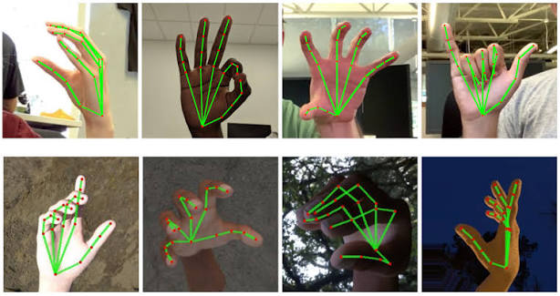
</p>
---

# 24. خطاهای رایج و Troubleshooting

## `ModuleNotFoundError: No module named 'cv2'`

```bash
pip install opencv-python
```

و مطمئن شوید همان Virtual Environment فعال است.

## دستور `python` شناخته نمی‌شود

```bash
python --version
```

یا روی بعضی Windowsها:

```bash
py --version
```

## Camera باز نمی‌شود

Indexهای مختلف را امتحان کنید:

```python
cv2.VideoCapture(0)
cv2.VideoCapture(1)
cv2.VideoCapture(2)
```

همچنین بررسی کنید:

- برنامه دیگری Camera را اشغال نکرده باشد؛
- Permission دوربین در سیستم‌عامل باز باشد؛
- Virtual Camera نرم‌افزار Iriun/DroidCam درست ایجاد شده باشد.

## `img is None`

معمولاً Path فایل اشتباه است.

```python
import os
print(os.getcwd())
```

## پنجره OpenCV پاسخ نمی‌دهد

در Loop باید `cv2.waitKey(...)` فراخوانی شود.

## YOLO کند است

دلایل متداول:

- اجرای CPU؛
- رزولوشن ورودی بالا؛
- مدل بزرگ؛
- چند Stream هم‌زمان.

راهکارهای اولیه:

- مدل Nano؛
- کاهش `imgsz`؛
- GPU؛
- Export به Runtime مناسب برای Deployment.

---

# 25. تمرین‌ها و پروژه‌های پیشنهادی

## تمرین 1 — Canny Lab

یک تصویر انتخاب کنید و حداقل پنج ترکیب Threshold مختلف تست کنید. برای هر تست ثبت کنید:

```text
threshold1
threshold2
result quality
noise level
```

## تمرین 2 — HSV Object Segmentation

یک جسم رنگی مثل توپ یا ماژیک انتخاب و با `cv2.inRange` جدا کنید.

```python
import cv2
import numpy as np

frame = cv2.imread("object.jpg")
hsv = cv2.cvtColor(frame, cv2.COLOR_BGR2HSV)

lower = np.array([30, 50, 50])
upper = np.array([90, 255, 255])

mask = cv2.inRange(hsv, lower, upper)

cv2.imshow("Mask", mask)
cv2.waitKey(0)
cv2.destroyAllWindows()
```

## تمرین 3 — Motion Alarm

اگر Contour بزرگ‌تر از Threshold بود، پیام زیر چاپ شود:

```text
Motion Detected!
```

سپس سیستم را طوری تغییر دهید که فقط وقتی حرکت چند Frame ادامه داشت Alert صادر کند.

## تمرین 4 — Detection Report

YOLO را روی پنج تصویر متفاوت اجرا کنید و برای هر تصویر بنویسید:

- چه چیزهایی درست تشخیص داده شد؟
- چه False Positiveهایی وجود داشت؟
- چه False Negativeهایی وجود داشت؟
- Confidenceها چقدر بودند؟
- نور و زاویه چه اثری داشتند؟

## تمرین 5 — Dataset Design

قبل از Training، طرح Dataset بنویسید:

```text
Classes:
Environment:
Lighting:
Angles:
Camera distance:
Occlusion:
Negative samples:
Number of images:
Train/Val/Test split:
```

## تمرین 6 — XR Thinking

مسئله زیر را طراحی کنید:

> در Mixed Reality باید یک ابزار واقعی روی میز شناسایی شود و مدل سه‌بعدی مجازی با آن Alignment پیدا کند.

مشخص کنید به کدام بخش‌ها نیاز دارید:

```text
Detection?
Segmentation?
Pose Estimation?
Depth?
Tracking?
Calibration?
World Coordinate Registration?
```

---

# 26. واژه‌نامه

| فارسی | English | توضیح کوتاه |
|---|---|---|
| بینایی ماشین | Computer Vision | استخراج اطلاعات از تصویر و ویدیو |
| پردازش تصویر | Image Processing | عملیات روی داده تصویری |
| پیکسل | Pixel | واحد نمونه‌برداری تصویر |
| ویژگی | Feature | بازنمایی مفید برای حل Task |
| استخراج ویژگی | Feature Extraction | ساخت یا یادگیری Feature |
| لبه | Edge | تغییر قابل توجه در شدت/رنگ |
| آستانه | Threshold | مرز تصمیم |
| دسته‌بندی | Classification | انتخاب Class برای ورودی |
| مکان‌یابی | Localization | تعیین محل Object |
| تشخیص شیء | Object Detection | Class + Bounding Box |
| تقسیم‌بندی | Segmentation | تفکیک در سطح Pixel |
| ردیابی | Tracking | دنبال‌کردن Object در زمان |
| مدل | Model | تابع پارامتری یادگرفته‌شده |
| پارامتر | Parameter | مقدار قابل یادگیری |
| وزن | Weight | ضریب اثر اتصال در شبکه |
| بایاس | Bias | پارامتر جابه‌جایی |
| تابع فعال‌سازی | Activation Function | ایجاد Non-linearity |
| عبور رو به جلو | Forward Pass | محاسبه Prediction |
| تابع خطا | Loss Function | معیار خطای Training |
| پس‌انتشار | Backpropagation | محاسبه Gradient از عقب |
| گرادیان | Gradient | حساسیت Loss به Parameter |
| بهینه‌ساز | Optimizer | روش Update Parameterها |
| نرخ یادگیری | Learning Rate | اندازه Step در Update |
| دوره | Epoch | یک عبور کامل از Train Data |
| دسته | Batch | زیرمجموعه داده در یک Step |
| استنتاج | Inference | استفاده از مدل آموزش‌دیده |
| داده آموزشی | Training Set | داده Update Weight |
| اعتبارسنجی | Validation Set | ارزیابی حین توسعه |
| آزمون | Test Set | ارزیابی نهایی |
| بیش‌برازش | Overfitting | وابستگی زیاد به Train |
| کم‌برازش | Underfitting | یادگیری ناکافی |
| تعمیم | Generalization | عملکرد روی داده جدید |
| انتقال یادگیری | Transfer Learning | استفاده از دانش مدل قبلی |
| ریزتنظیم | Fine-Tuning | ادامه آموزش مدل Pretrained |
| امتیاز اطمینان | Confidence Score | Score خروجی مدل |
| هم‌پوشانی | IoU | نسبت Intersection به Union |
| حذف غیر بیشینه | NMS | حذف Boxهای تکراری |
| شبکه عصبی | Neural Network | زنجیره‌ای از لایه‌های پارامتری |
| CNN | Convolutional Neural Network | شبکه مناسب داده مکانی مثل تصویر |
| کانولوشن | Convolution | عملگر محلی با Kernel |
| نقشه ویژگی | Feature Map | خروجی Featureهای Convolution |
| برچسب‌گذاری | Annotation | ساخت Ground Truth |
| داده‌افزایی | Data Augmentation | افزایش تنوع Train Data |

---

# 27. منابع برای مطالعه بیشتر

- MIT — Foundations of Computer Vision
- OpenCV Documentation
- PyTorch Tutorials — Autograd & Neural Networks
- Ultralytics Documentation
- مقاله **You Only Look Once: Unified, Real-Time Object Detection**
- مقاله **ImageNet Classification with Deep Convolutional Neural Networks (AlexNet)**
- Stanford CS231n — Convolutional Neural Networks for Visual Recognition

### لینک‌ها

- MIT Vision Book: https://visionbook.mit.edu/
- OpenCV: https://docs.opencv.org/
- PyTorch Tutorials: https://docs.pytorch.org/tutorials/
- Ultralytics Docs: https://docs.ultralytics.com/
- YOLO Paper: https://arxiv.org/abs/1506.02640
- CS231n: https://cs231n.stanford.edu/

---

# جمع‌بندی نهایی

اگر بخواهم کل این جلسه را در چند گزاره خلاصه کنم:

1. **تصویر برای ماشین در ابتدا فقط عدد است.**
2. پردازش تصویر به ما کمک می‌کند داده را تغییر دهیم، تمیز کنیم یا ساختارهای پایه‌ای از آن استخراج کنیم.
3. در روش‌های کلاسیک، انسان بخش زیادی از Feature Engineering را انجام می‌دهد.
4. در Deep Learning، بخش مهمی از Representation از خود داده یاد گرفته می‌شود.
5. یک نورون مصنوعی به تنهایی «هوشمند» نیست؛ قدرت از **شبکه، اتصال‌ها، Weightها و زنجیره تبدیل‌ها** می‌آید.
6. Training یعنی تکرار چرخه‌ی:

   ```text
   Forward → Loss → Backpropagation → Update
   ```

7. Backpropagation کمک می‌کند بفهمیم هر Parameter برای کاهش خطا در چه جهتی تغییر کند.
8. CNNها برای ساخت Representationهای تصویری بسیار مؤثرند.
9. Object Detection با Classification فرق دارد؛ Detection علاوه بر «چیست؟» به «کجاست؟» نیز پاسخ می‌دهد.
10. YOLO یکی از خانواده‌های مهم Detectorهای بلادرنگ است.
11. Dataset خوب، Label درست و Generalization از صرفاً زیادکردن Epoch مهم‌ترند.
12. در مهندسی واقعی همیشه باید بپرسیم: **آیا اصلاً برای این مسئله Deep Learning لازم است؟**
13. برای XR، بینایی ماشین می‌تواند حلقه اتصال **دوربین، جهان واقعی و فضای سه‌بعدی مجازی** باشد.

---

## حرف آخر

هدف من از این جلسه این نیست که شما چند دستور OpenCV یا YOLO را حفظ کنید. اگر تنها چیزی که از این فایل با خود ببرید این باشد که:

> «مدل یک جادوگر نیست؛ یک زنجیره بزرگ از محاسبات پارامتری است که با دیدن داده، اندازه‌گیری خطا و اصلاح مداوم وزن ارتباط‌ها، Representationهای مفیدتری برای حل مسئله می‌سازد»

آن وقت پایه فکری درستی برای ادامه مسیر دارید.

از این نقطه به بعد، هر مدل پیچیده‌تری که ببینیم—از CNN و YOLO تا Transformer و مدل‌های چندوجهی—می‌توانیم به جای ترس از اسم‌ها، آن را به اجزای قابل فهم‌تر بشکنیم:

```text
Data
→ Representation
→ Model
→ Objective
→ Optimization
→ Evaluation
→ Deployment
```

و این نگاه، چیزی است که در پروژه واقعی به کار ما می‌آید.

---

**علی نجارزادگان**  
درس‌نامه جلسه اول آشنایی با بینایی ماشین — ویژه دانشجویان XR
ان شاءالله مفید واقع بشیم. 
اگر کسی نظر یا ایده‌ای برای بهبود این طرح درس داشت، خوشحال می‌شم PR بزنید.

ممنونم از بچه‌های کلاس و بوت‌کمپ که بهم انگیزه دادن تا اینا رو بگم.
با تشکر از [علی تمیزی‌فر](https://scholar.google.com/citations?user=16f0zvYAAAAJ&hl=en)، راهنمای من در این مسیر 

</div>
