> به نام خدایی که نسبت محیط به قطر را دقیق می‌داند.🍀❤️

# جلسه دوم — از دیتاست و Annotation تا Training، ارزیابی و اجرای YOLO
## ساخت یک مسیر واقعی برای پروژه‌های بینایی ماشین

**گردآورنده: [علی نجارزادگان](https://www.linkedin.com/in/ali-najjarzadegan/)**،
**با همراهی: [نگار عرفانی](https://www.linkedin.com/in/negar-erfani-664910360/)**،

**ویژه دانشجویان XR — دانشگاه صنعتی اصفهان**

---

## درباره این درس‌نامه

جلسه اول را از پیکسل، لبه، Feature، شبکه عصبی و CNN شروع کردیم و تا اجرای YOLO جلو آمدیم. در جلسه دوم قرار نیست فقط چند دستور جدید یاد بگیریم. این بار می‌خواهیم از زاویه یک پروژه واقعی به مسئله نگاه کنیم:

```text
Problem Definition
      ↓
Data Collection
      ↓
Annotation
      ↓
Dataset Audit
      ↓
Train / Validation / Test
      ↓
Augmentation
      ↓
Model + Training
      ↓
Metrics + Error Analysis
      ↓
Inference
      ↓
Deployment / Integration
```

هدف من این است که اگر کسی در کلاس هم حضور نداشته باشد، با خواندن این فایل بتواند:

- نوع درست Annotation را برای پروژه انتخاب کند؛
- فرمت‌های Pascal VOC، COCO و YOLO را از هم تشخیص دهد؛
- یک Dataset تمیز و قابل آموزش بسازد؛
- Data Leakage را بشناسد؛
- Augmentation را هدفمند انتخاب کند؛
- یک YOLO را Fine-Tune کند؛
- خروجی هر Epoch را بخواند؛
- Precision، Recall و mAP را بفهمد؛
- Overfitting و Underfitting را از روی نمودارها تشخیص دهد؛
- سخت‌افزار، Batch، Workers و ImgSize را تنظیم کند؛
- و در نهایت بداند نتیجه مدل را چگونه وارد یک پروژه واقعی، رباتیک یا XR کند.

> [!NOTE]
> این درس‌نامه ادامه مستقیم جلسه اول است. اگر مفاهیم Weight، Loss، Backpropagation، CNN، Inference و Transfer Learning برایتان مبهم است، ابتدا فایل جلسه اول را مرور کنید.

---

# فهرست مطالب

1. [از مسئله تا مدل: نقشه مهندسی جلسه دوم](#1-از-مسئله-تا-مدل-نقشه-مهندسی-جلسه-دوم)
2. [سیستم‌عامل، Python و محیط اجرای پروژه](#2-سیستمعامل-python-و-محیط-اجرای-پروژه)
3. [مرور کوتاه وظایف اصلی Computer Vision](#3-مرور-کوتاه-وظایف-اصلی-computer-vision)
4. [Bounding Box را دقیق بفهمیم](#4-bounding-box-را-دقیق-بفهمیم)
5. [Pascal VOC، COCO و YOLO چه فرقی دارند؟](#5-pascal-voc-coco-و-yolo-چه-فرقی-دارند)
6. [Normalization و تبدیل مختصات](#6-normalization-و-تبدیل-مختصات)
7. [انواع Annotation: Detection، OBB، Segmentation و Keypoint](#7-انواع-annotation-detection-obb-segmentation-و-keypoint)
8. [قانون طلایی Annotation تیمی](#8-قانون-طلایی-annotation-تیمی)
9. [ابزارهای Labeling و انتخاب ابزار مناسب](#9-ابزارهای-labeling-و-انتخاب-ابزار-مناسب)
10. [پیدا کردن Dataset و ارزیابی کیفیت آن](#10-پیدا-کردن-dataset-و-ارزیابی-کیفیت-آن)
11. [حریم خصوصی، License و Dataset Card](#11-حریم-خصوصی-license-و-dataset-card)
12. [Train، Validation، Test و Data Leakage](#12-train-validation-test-و-data-leakage)
13. [K-Fold Cross Validation](#13-k-fold-cross-validation)
14. [ساختار پوشه Dataset و data.yaml](#14-ساختار-پوشه-dataset-و-datayaml)
15. [Dataset Audit: قبل از Train چه چیزهایی را چک کنیم؟](#15-dataset-audit-قبل-از-train-چه-چیزهایی-را-چک-کنیم)
16. [Data Augmentation هدفمند](#16-data-augmentation-هدفمند)
17. [معماری YOLO: Backbone، Neck و Head](#17-معماری-yolo-backbone-neck-و-head)
18. [Training عمیق‌تر: Epoch، Batch، Iteration، Optimizer و Learning Rate](#18-training-عمیقتر-epoch-batch-iteration-optimizer-و-learning-rate)
19. [Preprocess، Process، Postprocess و DataLoader](#19-preprocess-process-postprocess-و-dataloader)
20. [Resize، Letterbox و تعداد کانال‌ها](#20-resize-letterbox-و-تعداد-کانالها)
21. [ارزیابی مدل: TP، TN، FP، FN، Precision، Recall و mAP](#21-ارزیابی-مدل-tp-tn-fp-fn-precision-recall-و-map)
22. [تمرین تکمیلی: آموزش مدل اختصاصی](#22-تمرین-تکمیلی-آموزش-مدل-اختصاصی)
23. [خواندن خروجی هر Epoch و نمودارهای Training](#23-خواندن-خروجی-هر-epoch-و-نمودارهای-training)
24. [نصب PyTorch، CUDA و Ultralytics](#24-نصب-pytorch-cuda-و-ultralytics)
25. [تنظیم سخت‌افزار: Batch، Workers، Device و Memory](#25-تنظیم-سختافزار-batch-workers-device-و-memory)
26. [پروژه عملی ۱: ردیاب بادکنک و Gimbal Control](#26-پروژه-عملی-۱-ردیاب-بادکنک-و-gimbal-control)
27. [پروژه عملی ۲: هشدار عبور از خط زرد مترو](#27-پروژه-عملی-۲-هشدار-عبور-از-خط-زرد-مترو)
28. [پروژه عملی ۳: Line Crossing و Tracking با ByteTrack](#28-پروژه-عملی-۳-line-crossing-و-tracking-با-bytetrack)
29. [پروژه پیشنهادی: Face / Emotion و ملاحظات داده](#29-پروژه-پیشنهادی-face--emotion-و-ملاحظات-داده)
30. [TensorRT، Export و Deployment](#30-tensorrt-export-و-deployment)
31. [مدیریت Dataset تیمی و Google Sheet](#31-مدیریت-dataset-تیمی-و-google-sheet)
32. [اشتباه‌های رایج و Troubleshooting](#33-اشتباههای-رایج-و-troubleshooting)
33. [واژه‌نامه جلسه دوم](#34-واژهنامه-جلسه-دوم)
34. [منابع پیشنهادی](#36-منابع-پیشنهادی)
35. [جمع‌بندی نهایی](#37-جمعبندی-نهایی)

---

# 1. از مسئله تا مدل: نقشه مهندسی جلسه دوم

یکی از اشتباه‌های رایج این است که پروژه بینایی ماشین را از انتخاب مدل شروع کنیم:

```text
"YOLO بزنیم؟"
"CNN بزنیم؟"
"Segmentation بهتر نیست؟"
```

ولی سؤال اول باید این باشد:

> **مسئله واقعی ما چیست و خروجی مورد نیاز دقیقا چیست؟**

مثلا اگر قرار است ورود یک جسم به یک محدوده ثابت را تشخیص بدهیم، شاید اصلا نیازی به Deep Learning نباشد. ممکن است یک Sensor، Color Mask، Motion Detection یا Rule ساده کار را با هزینه کمتر و سرعت بیشتر انجام دهد.

پس قبل از Model Selection این پرسش‌ها را بنویسید:

```text
What is the input?
What is the required output?
What error is acceptable?
Which error is dangerous?
What is the latency limit?
What hardware is available?
How much data do we have?
Can a simpler method solve it?
```

این نگاه همان Trade-off مهندسی است: بهترین سیستم همیشه پیچیده‌ترین سیستم نیست.

> [!IMPORTANT]
> اگر یک مسئله با Sensor ساده، Geometry، Threshold یا Image Processing قابل حل است، فقط برای جذاب بودن اسم AI سراغ شبکه عصبی نروید. در پروژه واقعی، سادگی یک مزیت مهندسی است.

---

# 2. سیستم‌عامل، Python و محیط اجرای پروژه
- &#x200F;**Linux** در سرورها، Workstationهای AI، Docker، CUDA و بسیاری از Workflowهای پژوهشی بسیار رایج است.
- &#x200F;**Windows** برای توسعه کاملا قابل استفاده است و **WSL2** می‌تواند بسیاری از ابزارهای Linux را در اختیار شما بگذارد.
- &#x200F;**macOS** برای توسعه Python و مدل‌های سبک مناسب است، ولی CUDA مخصوص GPUهای NVIDIA است و روی macOS در دسترس نیست. Apple Silicon مسیرهای پردازشی خودش را دارد.

پس یک «بهترین سیستم‌عامل مطلق» نداریم. انتخاب به Toolchain، GPU، Deployment و تجربه تیم بستگی دارد.

## نسخه Python

برای پروژه‌ای که قرار است چند Package یادگیری عمیق داشته باشد، مهم‌تر از دنبال‌کردن یک عدد ثابت این است که **نسخه Python با PyTorch و Packageهای پروژه سازگار باشد**.

برای پروژه آموزشی، Python 3.10 یا 3.11 معمولا انتخاب کم‌دردسری است، ولی قبل از ساخت محیط Production باید Compatibility پکیج‌ها را بررسی کنید.

## ساخت محیط مجازی

### Windows PowerShell

```powershell
python -m venv cv_env2
.\cv_env2\Scripts\Activate.ps1
python -m pip install --upgrade pip
```

### Windows CMD

```cmd
python -m venv cv_env2
cv_env2\Scripts\activate.bat
```

### Linux / macOS

```bash
python3 -m venv cv_env2
source cv_env2/bin/activate
python -m pip install --upgrade pip
```

خروج از محیط:

```bash
deactivate
```

---

# 3. مرور کوتاه وظایف اصلی Computer Vision

جلسه اول این سلسله را دیدیم:

```text
Classification
    ↓
Localization
    ↓
Object Detection
    ↓
Segmentation
    ↓
Tracking
```

اما در جلسه دوم باید خروجی هرکدام را به Annotation مرتبط کنیم.

| Task | سؤال | Label مورد نیاز |
|---|---|---|
| Classification | این تصویر چیست؟ | Class برای کل تصویر |
| Localization | شیء کجاست؟ | معمولا یک Bounding Box |
| Detection | چه اشیایی و کجا؟ | چند Bounding Box + Class |
| OBB Detection | شیء چرخیده کجاست؟ | Oriented Box |
| Segmentation | دقیقا کدام Pixelها متعلق به شیء هستند؟ | Mask یا Polygon |
| Pose | نقاط مهم بدن یا شیء کجا هستند؟ | Keypoints |
| Tracking | این Object در Frame بعدی کدام است؟ | Detection + ID در طول زمان |

> [!TIP]
> قبل از شروع Annotation، نوع Task را قطعی کنید. تبدیل چند هزار Bounding Box به Polygon بعد از شروع پروژه، هزینه زیادی دارد.

<p align="center">
  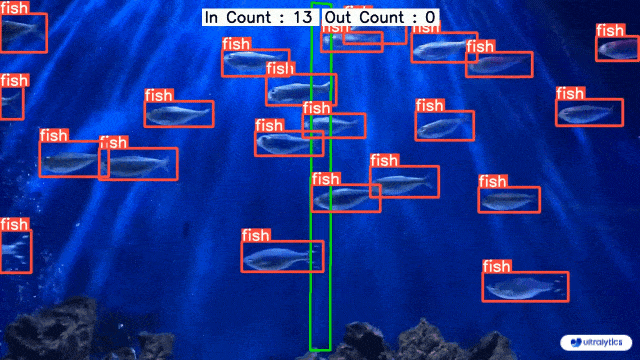
</p>

---

# 4. Bounding Box را دقیق بفهمیم

Bounding Box ساده یک مستطیل Axis-Aligned است. در یک تصویر دوبعدی معمولا دستگاه مختصات از گوشه بالا-چپ شروع می‌شود:

```text
(0,0) ───────────────→ x
  │
  │       ┌──────────────┐
  │       │    Object    │
  │       └──────────────┘
  │
  ↓ y
```

دو روش متداول برای توصیف Box:

```text
xyxy = xmin, ymin, xmax, ymax
```

یا:

```text
xywh = x, y, width, height
```

نکته مهم این است که `x, y` در `xywh` همیشه یک معنی ثابت در همه Formatها ندارد. در COCO معمولا `x, y` گوشه بالا-چپ است، ولی در YOLO `x_center, y_center` مرکز Box است.

<p align="center">
  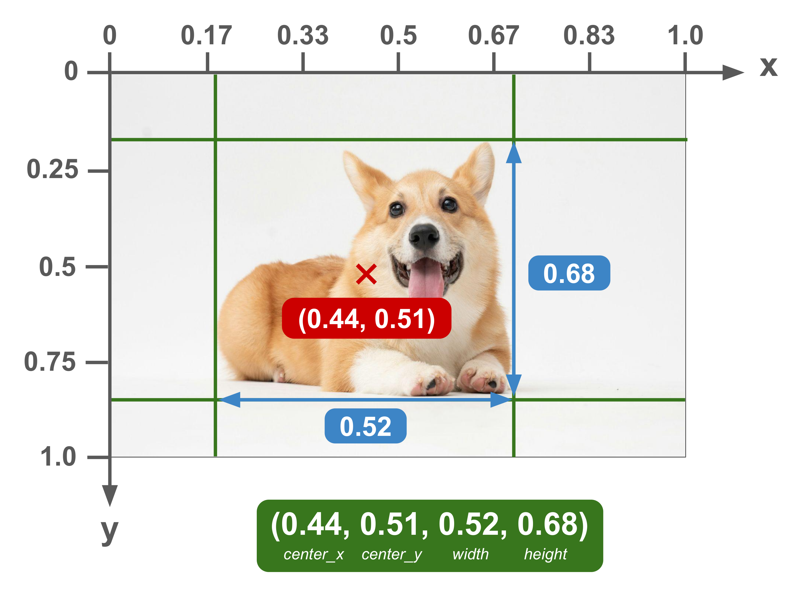
</p>

## Tight Box یا Loose Box؟

در کلاس درباره Boxهای گشاد و مماس صحبت شد. در Dataset واقعی باید **Annotation Policy** داشته باشیم.

اگر یک نفر Box را خیلی گشاد بکشد و نفر دیگر آن را تنگ و مماس با Object بزند، Ground Truth ناسازگار می‌شود. مدل قرار است یک الگو از Labelهای ما یاد بگیرد؛ اگر خود ما توافق نداشته باشیم، انتظار خروجی پایدار از مدل منطقی نیست.

> [!CAUTION]
> برای Object Detection عمومی، معمولا Box باید تا حد ممکن Object را پوشش دهد و Background اضافه کمی داشته باشد. برای Objectهای Occluded یا Truncated باید Rule مشخص تیمی داشته باشید.

## Oriented Bounding Box

اگر جهت Object مهم باشد یا Objectها با زاویه زیاد در تصویر دیده شوند، OBB می‌تواند Background اضافه را کمتر کند. این موضوع در تصاویر هوایی، قطعات صنعتی و اجسام کشیده بسیار مهم می‌شود.

<p align="center">
  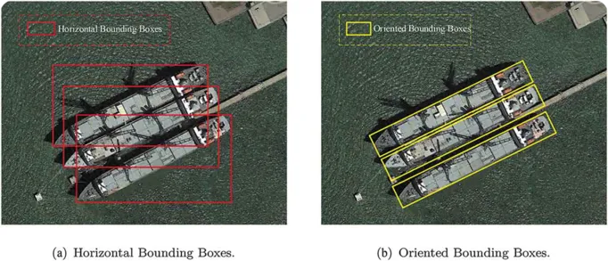
</p>

---

# 5. Pascal VOC، COCO و YOLO چه فرقی دارند؟
## Pascal VOC

Bounding Box معمولا به صورت:

```text
xmin, ymin, xmax, ymax
```

و غالبا در فایل XML ذخیره می‌شود.

نمونه مفهومی:

```xml
<object>
    <name>cat</name>
    <bndbox>
        <xmin>120</xmin>
        <ymin>80</ymin>
        <xmax>420</xmax>
        <ymax>360</ymax>
    </bndbox>
</object>
```

## COCO Detection Format

COCO از JSON استفاده می‌کند و Bounding Box به شکل زیر است:

```text
[x, y, width, height]
```

که `x, y` معمولا مختصات گوشه بالا-چپ Box به واحد Pixel هستند.

نمونه:

```json
{
  "image_id": 15,
  "category_id": 3,
  "bbox": [120, 80, 300, 280]
}
```

## YOLO Detection Format

هر Object معمولا یک خط در فایل `.txt` دارد:

```text
class_id x_center y_center width height
```

چهار مقدار هندسی به صورت نرمال‌شده بین 0 و 1 هستند.

نمونه:

```text
0 0.512300 0.443100 0.221000 0.310500
```

اگر یک تصویر سه Object داشته باشد، Label آن سه خط خواهد داشت.

<p align="center">
  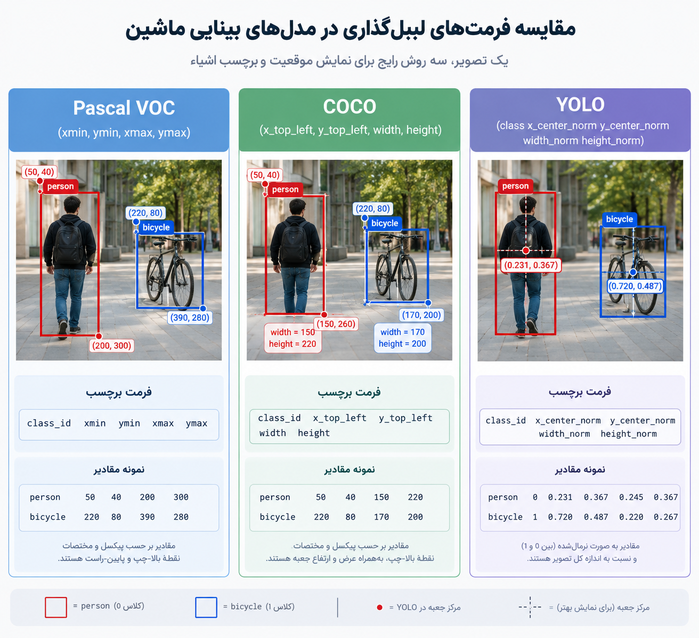
</p>

---

# 6. Normalization و تبدیل مختصات
چرا نرمالایز می‌کنیم لیبل‌ها رو و عددی بین 0 تا 1 هست، زیرا در تغییر اندازه تصویر، واحد پیکسل مناسب نیست و ممکن است جا بماند. فلذا همه چیز را تقسیم بر طول و عرض کل عکس می‌کنیم.
فرض کنید اندازه تصویر:

```text
W = 1920
H = 1080
```

و Bounding Box در Pascal VOC:

```text
xmin = 480
ymin = 270
xmax = 960
ymax = 810
```

ابتدا مرکز و اندازه Box در Pixel:

```text
x_center_px = (xmin + xmax) / 2
              = 720

y_center_px = (ymin + ymax) / 2
              = 540

box_width_px  = xmax - xmin = 480
box_height_px = ymax - ymin = 540
```

حالا Normalization:

```text
x_center = 720 / 1920 = 0.375
y_center = 540 / 1080 = 0.500
width    = 480 / 1920 = 0.250
height   = 540 / 1080 = 0.500
```

پس خط YOLO:

```text
class_id 0.375 0.500 0.250 0.500
```

## تبدیل Pascal VOC به YOLO با Python

```python
def voc_to_yolo(xmin, ymin, xmax, ymax, image_width, image_height):
    x_center_px = (xmin + xmax) / 2.0
    y_center_px = (ymin + ymax) / 2.0
    box_width_px = xmax - xmin
    box_height_px = ymax - ymin

    x_center = x_center_px / image_width
    y_center = y_center_px / image_height
    width = box_width_px / image_width
    height = box_height_px / image_height

    return x_center, y_center, width, height


box = voc_to_yolo(
    xmin=480,
    ymin=270,
    xmax=960,
    ymax=810,
    image_width=1920,
    image_height=1080
)

print(box)
```

## تبدیل YOLO به Pixel

```python
def yolo_to_xyxy(x_center, y_center, width, height, image_width, image_height):
    x_center_px = x_center * image_width
    y_center_px = y_center * image_height
    box_width_px = width * image_width
    box_height_px = height * image_height

    xmin = x_center_px - box_width_px / 2
    ymin = y_center_px - box_height_px / 2
    xmax = x_center_px + box_width_px / 2
    ymax = y_center_px + box_height_px / 2

    return xmin, ymin, xmax, ymax
```

## یک نکته ظریف درباره Resize

Normalized coordinate باعث می‌شود Label نسبت به ابعاد تصویر بیان شود. اگر فقط Resize یکنواخت انجام شود و Geometry تصویر حفظ شود، Mapping ساده باقی می‌ماند. ولی اگر Crop، Rotation، Perspective Transform یا Letterbox انجام دهید، Annotation باید همراه همان Transform به‌روز شود.

پس این جمله را به خاطر بسپارید:

> **Normalization مشکل Scale را حل می‌کند، نه تمام Transformهای هندسی را.**

---

# 7. انواع Annotation: Detection، OBB، Segmentation و Keypoint

نوع Label باید از خروجی مورد انتظار بیاید.

## Classification

```text
image.jpg → cat
```

## Detection

```text
class + bounding box
```

## OBB

Box همراه Rotation.

## Polygon / Instance Segmentation

مرز Object با مجموعه‌ای از نقاط مشخص می‌شود.

<p align="center">
  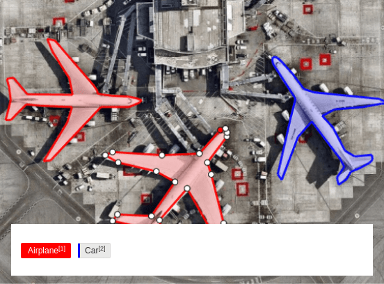
</p>

نمونه مفهومی YOLO Segmentation:

```text
0 0.51 0.32 0.55 0.30 0.58 0.35 0.54 0.40 0.50 0.38
```

## Keypoint / Pose

نقاط مهم مثل:

```text
shoulder
elbow
wrist
hip
knee
ankle
```
<p align="center">
  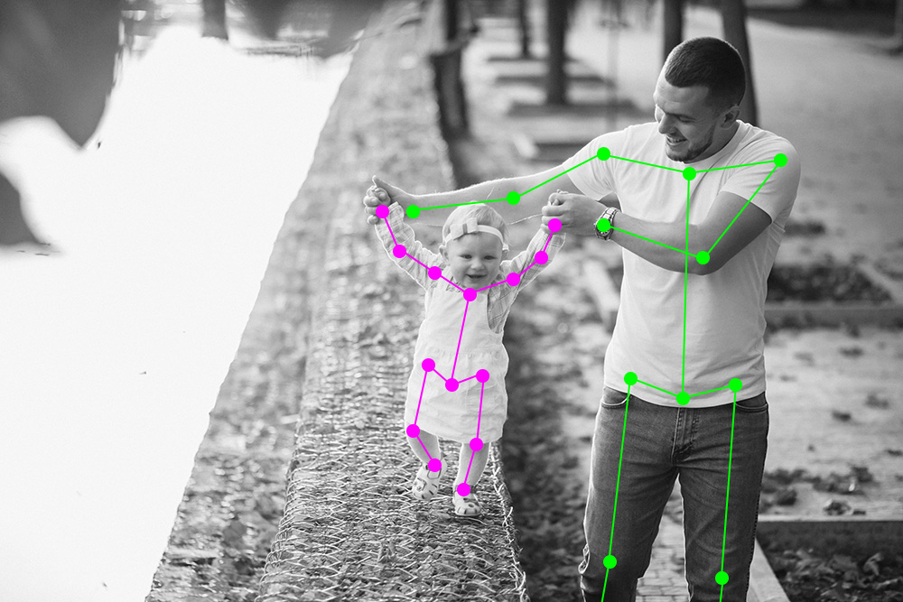
</p>

در XR این نوع خروجی برای Body Tracking، Gesture و Interaction بسیار مهم است.

## Segmentation چرا هزینه بیشتری دارد؟

رسم Bounding Box با چهار حرکت ساده تمام می‌شود. اما Polygon ممکن است ده‌ها نقطه داشته باشد. هرچه Object پیچیده‌تر، باریک‌تر یا مرز آن نامنظم‌تر باشد، Annotation زمان بیشتری می‌گیرد.

در جزوه عدد مشخصی برای افزایش زمان Segmentation ثبت شده بود. این مقدار در پروژه‌های مختلف ثابت نیست، چون زمان به Tool، شکل Object، تعداد نقاط Polygon و مهارت Annotator وابسته است. نکته اصلی درست است: **Segmentation معمولا Annotation گران‌تری از Bounding Box دارد.**

---

# 8. قانون طلایی Annotation تیمی

یکی از مهم‌ترین چیزهایی که از کار تیمی باید یاد بگیریم این است:

> **Consistency از تعداد خام Label مهم‌تر است.**

اگر پنج نفر Annotation می‌کنند، باید قبل از شروع یک Guide مشترک داشته باشند.

## نمونه Annotation Guide

```text
Class: red_balloon

1. Box باید Tight باشد.
2. نخ بادکنک داخل Box حساب نشود.
3. بادکنک‌های کمتر از 8×8 pixel لیبل نشوند.
4. اگر بیش از 70 درصد Object پنهان است، لیبل نزنیم.
5. اگر بخشی از Object بیرون Frame است، Box تا مرز Frame ادامه پیدا کند.
6. بادکنک غیرقرمز با Class دیگری ثبت شود یا Ignore شود.
7. Reflection روی شیشه Object مستقل حساب نشود.
```

این Ruleها بسته به پروژه تغییر می‌کنند. مهم این است که نوشته شوند.

## مرحله QA

Annotation تیمی بهتر است دو مرحله داشته باشد:

```text
Annotator
    ↓
Reviewer
    ↓
Approved Data
```

Reviewer باید نمونه‌های زیر را پیدا کند:

- Boxهای خیلی گشاد؛
- Objectهای جاافتاده؛
- Class اشتباه؛
- Labelهای خارج تصویر؛
- فایل‌های بدون Label غیرمنتظره؛
- Duplicate Image؛
- Annotation ناسازگار بین افراد.

### تجربه پیشنهادی

قبل از تقسیم Dataset بزرگ، همه اعضا **همان 20 تصویر مشترک** را جداگانه Label کنند. سپس خروجی‌ها را کنار هم بگذارید. اختلاف Policyها خیلی زود مشخص می‌شود.

---

# 9. ابزارهای Labeling و انتخاب ابزار مناسب

## LabelImg

ساده، سبک و مناسب Bounding Boxهای پایه.

```bash
pip install labelImg
labelImg
```

در بعضی سیستم‌ها نصب Package آماده ممکن است دردسر داشته باشد. نسخه Repository نیز قابل اجرا است:

```bash
git clone https://github.com/HumanSignal/labelImg.git
cd labelImg
pip install pyqt5 lxml
python labelImg.py
```

نکته مهم:

- فرمت خروجی را بررسی کنید؛
- اگر پروژه YOLO است، مطمئن شوید YOLO format انتخاب شده؛
- نام Classها بین تمام تصاویر ثابت بماند.

## Roboflow

برای:

- Annotation آنلاین؛
- کار تیمی؛
- Dataset Version؛
- Preprocessing؛
- Augmentation؛
- Export به Formatهای مختلف

مناسب است.

## CVAT

برای پروژه‌های جدی‌تر، Video Annotation، Polygon، Tracking Annotation، Keypoint و Workflow تیمی گزینه قدرتمندی است.

CVAT را می‌توان با Docker اجرا کرد. Docker Desktop در Windows/macOS و Docker Engine در Linux می‌تواند میزبان آن باشد؛ بنابراین محدود به Linux نیست.

```bash
git clone https://github.com/cvat-ai/cvat
cd cvat
docker compose up -d
```

## Label Studio

یک Annotation Platform عمومی است و فقط مخصوص Object Detection نیست. برای Image، Text، Audio و Taskهای متنوع قابل استفاده است.

## انتخاب سریع

| نیاز | پیشنهاد |
|---|---|
| چند Box ساده و آفلاین | LabelImg |
| تیم دانشجویی و Export سریع | Roboflow |
| پروژه بزرگ، Video، Polygon، Workflow | CVAT |
| Taskهای چندنوعی و عمومی | Label Studio |

<p align="center">
  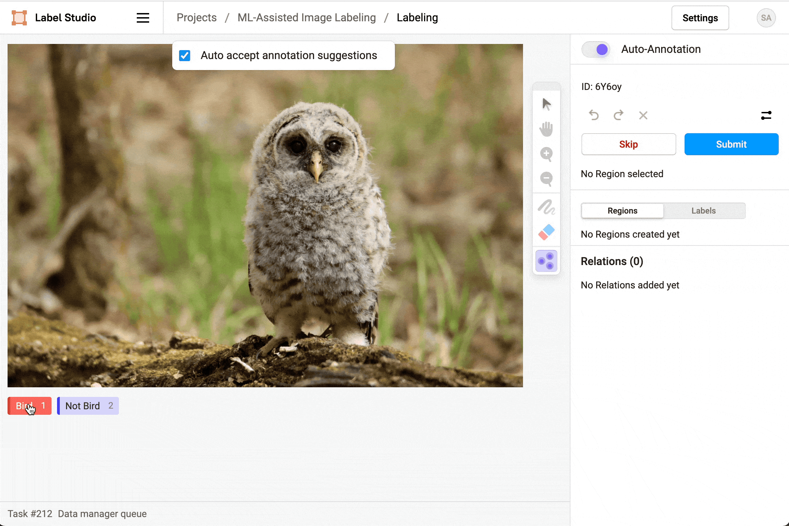
</p>
<p align="center">
  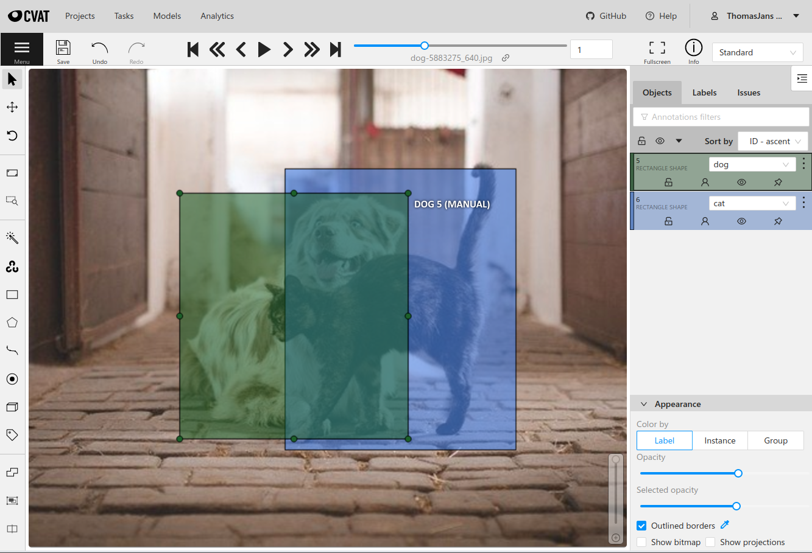
</p>
---

# 10. پیدا کردن Dataset و ارزیابی کیفیت آن

قبل از ساخت Dataset از صفر، جستجو کنید.

منابع مهم:

- Roboflow Universe
- Kaggle Datasets
- Hugging Face Datasets
- Google Dataset Search
- COCO
- Google Open Images
- Papers with Code
- GitHub Repositoryها
- صفحه Supplementary مقاله‌ها
- Datasetهای منتشرشده توسط دانشگاه‌ها و آزمایشگاه‌ها
- سایت‌هایی مثل PTO، ninja, etc.
## قبل از Download چه چیزی را ببینیم؟

README، Sample Image و Label Preview را بررسی کنید.

پرسش‌های مهم:

```text
آیا Classهای من را دارد؟
آیا Label format مشخص است؟
آیا کیفیت تصویر مناسب است؟
آیا Data تکراری زیاد دارد؟
آیا زاویه‌ها متنوع‌اند؟
آیا License اجازه استفاده من را می‌دهد؟
آیا Domain داده شبیه محیط واقعی من است؟
```

## Git LFS

بعضی Repositoryهای GitHub فایل‌های بزرگ را با Git LFS نگه می‌دارند. در آن حالت Clone ساده ممکن است به جای فایل واقعی Pointer بگیرد. اگر Repository از LFS استفاده می‌کند، Git LFS را نصب و فعال کنید.

---

# 11. حریم خصوصی، License و Dataset Card

Dataset فقط یک پوشه عکس نیست.

اگر تصویر شامل:

- چهره؛
- پلاک خودرو؛
- فضای خصوصی؛
- اطلاعات بیمار؛
- داده سازمانی؛
- یا محتوای دارای Copyright

باشد، باید مسئله حقوقی و اخلاقی را جدی بگیرید.

این کار برای پروژه دانشجویی هم ارزش دارد، چون مجبور می‌شوید درباره محدودیت داده فکر کنید.
یه کوچولو جلوتر در مورد شیت دیتا و ارزش گذاری و ثبت و ضبط دیتاها صحبت می‌کنم. حواستون باشه اون تیکه، واقعا مهمه و برای کار گروهی و فردی، حتما این Sheet الزامی می‌شه تا بفهمیم داریم چه می‌کنیم...

---

# 12. Train، Validation، Test و Data Leakage

سه بخش را باید از نظر نقش جدا کنیم.

## Train

Weightها با این داده Update می‌شوند.

## Validation

برای ارزیابی حین توسعه، انتخاب Hyperparameter، Early Stopping و بررسی Overfitting استفاده می‌شود.

## Test

برای ارزیابی نهایی و بی‌طرفانه استفاده می‌شود.

یک Split رایج می‌تواند باشد:

```text
80% Train
10% Validation
10% Test
```

اما این قانون ثابت نیست. برای Datasetهای متفاوت نسبت‌های دیگری ممکن است بهتر باشند.

> [!IMPORTANT]
> البته گاهی لازم نیست که دیتای test وجود داشته باشد و می‌توان در صورت کمبود دیتا،أاز test به عنوان train استفاده کرد. البته به روش k-fold در ادامه خواهیم پرداخت.

به مثال پائین البته توجه کنید: نباید استخراج فریم، موجب شود آن سه دسته بندی، موجب شود دیتای تکراری یا بسیار شبیه، در این‌ها قرار گیرد.

### مثال مهم در ویدیو

فرض کنید از یک ویدیوی 30 FPS، فریم‌های پشت سر هم استخراج کنید:

```text
frame_100 → Train
frame_101 → Validation
frame_102 → Test
```

این سه تصویر تقریبا یکسان‌اند. مدل عملا Scene را دیده است.

راه بهتر:

```text
Video A → Train
Video B → Validation
Video C → Test
```

یا حداقل Split را بر اساس Sequence، Subject، Location یا Session انجام دهید.


## اسکریپت Split ساده

```python
from pathlib import Path
import random
import shutil

random.seed(42)

images_dir = Path("raw_images")
labels_dir = Path("raw_labels")
out_dir = Path("dataset")

images = [
    p for p in images_dir.iterdir()
    if p.suffix.lower() in {".jpg", ".jpeg", ".png"}
]

random.shuffle(images)

n = len(images)
train_end = int(n * 0.8)
val_end = int(n * 0.9)

splits = {
    "train": images[:train_end],
    "val": images[train_end:val_end],
    "test": images[val_end:],
}

for split_name, split_images in splits.items():
    image_out = out_dir / "images" / split_name
    label_out = out_dir / "labels" / split_name
    image_out.mkdir(parents=True, exist_ok=True)
    label_out.mkdir(parents=True, exist_ok=True)

    for image_path in split_images:
        shutil.copy2(image_path, image_out / image_path.name)

        label_path = labels_dir / f"{image_path.stem}.txt"
        if label_path.exists():
            shutil.copy2(label_path, label_out / label_path.name)

for split_name, split_images in splits.items():
    print(split_name, len(split_images))
```

---

# 13. K-Fold Cross Validation

اگر Dataset کوچک باشد، یک Split ثابت ممکن است به شانس حساس باشد.

در 5-Fold:

```text
Fold 1: [V | T | T | T | T]
Fold 2: [T | V | T | T | T]
Fold 3: [T | T | V | T | T]
Fold 4: [T | T | T | V | T]
Fold 5: [T | T | T | T | V]
```

هر بخش یک بار Validation و چهار بار Train می‌شود.

> [!IMPORTANT]
> 1. `K` مجبور نیست عدد فرد باشد. 5 و 10 انتخاب‌های رایج‌اند، ولی K می‌تواند عددهای دیگری هم باشد.
> 2. Fold معمولا در **Training Runهای جدا** می‌چرخد، نه اینکه Validation Fold در هر Epoch همان Run عوض شود.

## نمونه با scikit-learn

```python
from sklearn.model_selection import KFold
import numpy as np

files = np.array([
    "img001.jpg",
    "img002.jpg",
    "img003.jpg",
    "img004.jpg",
    "img005.jpg",
    "img006.jpg",
])

kf = KFold(n_splits=3, shuffle=True, random_state=42)

for fold, (train_idx, val_idx) in enumerate(kf.split(files), start=1):
    print(f"Fold {fold}")
    print("Train:", files[train_idx])
    print("Val:  ", files[val_idx])
```

## چه زمانی K-Fold ارزش دارد؟

- Dataset کوچک؛
- مقاله و Benchmark؛
- مقایسه دو Model؛
- وقتی نگران هستید نتیجه Split تصادفی باشد.

برای Dataset بزرگ و Training سنگین، K بار Train کامل می‌تواند بسیار پرهزینه باشد.

<p align="center">
  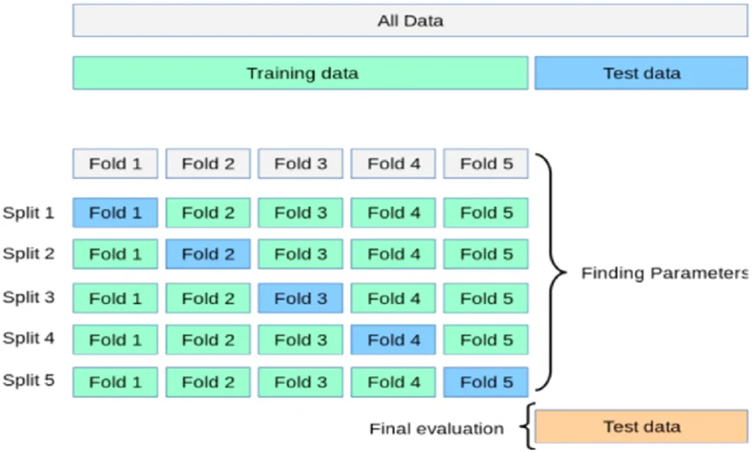
</p>
البته در این تصویر، test همان تستی است که در هر ایپاک انجام می‌شود و معنی همان val می‌دهد.
---

# 14. ساختار پوشه Dataset و data.yaml

ساختار رایج Detection:

```text
dataset/
│
├── images/
│   ├── train/
│   ├── val/
│   └── test/
│
└── labels/
    ├── train/
    ├── val/
    └── test/
```

قاعده مهم:

```text
images/train/cat_001.jpg
labels/train/cat_001.txt
```

نام Stem باید یکی باشد.

## data.yaml

```yaml
path: ./dataset

train: images/train
val: images/val
test: images/test

names:
  0: cat
  1: dog
```

در بعضی Configها `nc` نیز دیده می‌شود:

```yaml
nc: 2
names: ["cat", "dog"]
```

در نسخه‌های جدید Tooling ممکن است تعداد کلاس‌ها از `names` استنباط شود. مهم این است که Config شما با نسخه Library سازگار باشد.

---

# 15. Dataset Audit: قبل از Train چه چیزهایی را چک کنیم؟

قبل از اینکه GPU را ساعت‌ها درگیر کنید، Dataset را Audit کنید.

## چک‌لیست

- [ ] هر Image فایل Label متناظر دارد یا دلیل مشخصی برای Empty Label وجود دارد
- [ ] همه `class_id`ها معتبرند
- [ ] همه مختصات YOLO بین 0 و 1 هستند
- [ ] width و height مثبت‌اند
- [ ] فایل خراب وجود ندارد
- [ ] Duplicate زیاد نداریم
- [ ] Class imbalance شدید بررسی شده
- [ ] تصاویر بسیار تار یا اشتباه حذف شده‌اند
- [ ] Train/Val/Test Leakage ندارند
- [ ] Annotation Policy یکسان است

## اسکریپت ساده بررسی Labelهای YOLO

```python
from pathlib import Path

labels_dir = Path("dataset/labels/train")
num_classes = 2

errors = []

for txt_file in labels_dir.glob("*.txt"):
    for line_number, line in enumerate(txt_file.read_text().splitlines(), start=1):
        if not line.strip():
            continue

        parts = line.split()

        if len(parts) != 5:
            errors.append((txt_file.name, line_number, "expected 5 values"))
            continue

        class_id = int(parts[0])
        x, y, w, h = map(float, parts[1:])

        if not 0 <= class_id < num_classes:
            errors.append((txt_file.name, line_number, "invalid class id"))

        if not all(0.0 <= value <= 1.0 for value in [x, y, w, h]):
            errors.append((txt_file.name, line_number, "coordinate out of [0,1]"))

        if w <= 0 or h <= 0:
            errors.append((txt_file.name, line_number, "non-positive box size"))

print("Errors:", len(errors))
for error in errors[:20]:
    print(error)
```

## یک تجربه ارزشمند

قبل از Training، 50 تصویر Random را با Label روی تصویر رسم کنید و با چشم ببینید. خیلی از خطاهایی که Script پیدا نمی‌کند، چشم انسان در چند دقیقه پیدا می‌کند.

---

# 16. Data Augmentation هدفمند

Augmentation برای ساخت تنوع مصنوعی است، نه ساخت داده جعلی بی‌منطق.

نمونه‌ها:

| Augmentation | کاربرد |
|---|---|
| Horizontal Flip | تغییر جهت افقی |
| Vertical Flip | فقط اگر در Domain منطقی باشد |
| Rotation | تغییر زاویه |
| Scale / Zoom | تغییر فاصله ظاهری |
| Translation | تغییر مکان Object در Frame |
| Brightness / Contrast | تغییر نور |
| HSV | تغییر رنگ و نور |
| Blur | Motion/Defocus Blur |
| Noise | Sensor Noise |
| Mosaic | ترکیب چند Scene |
| MixUp | ترکیب دو Sample |
| Random Erasing | شبیه‌سازی Occlusion |

## Augmentation باید Domain-aware باشد

اگر قرار است Text یا تابلو را بخوانید، Flip ممکن است معنی را خراب کند.

اگر پروژه خودرو در جاده است، Flip افقی اغلب منطقی است، ولی Flip عمودی ماشین را روی سقف می‌گذارد و شاید برای Domain واقعی بی‌معنی باشد.

اگر جسم قرمز بودنش بخش اصلی تعریف Class است، تغییر شدید Hue ممکن است Label را خراب کند.
آگمنتیشن برای شرایط واقعی خودتون بزنید. هرچیزی هم نه، مدل آورفیت می‌شه. مثلا اگه کارتون با دوربینی هست که فوکوس اتومات نداره، آگمنتیشن مات کردن، خیلی کمک کنندس.
## Ultralytics Training Example

```python
from ultralytics import YOLO

model = YOLO("yolov8n.pt")

model.train(
    data="data.yaml",
    epochs=50,
    imgsz=640,
    mosaic=1.0,
    hsv_h=0.015,
    hsv_s=0.7,
    hsv_v=0.4,
    fliplr=0.5,
    degrees=10.0,
)
```

پارامترهای موجود ممکن است با نسخه Library تغییر کنند. Documentation نسخه نصب‌شده را ملاک قرار دهید.

<p align="center">
  
</p>
<p align="center">
  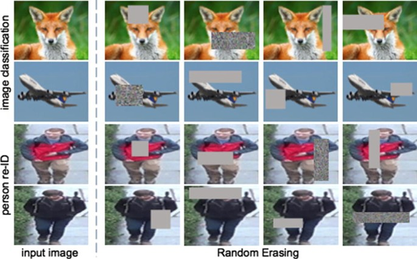
</p>

# 17. معماری YOLO: Backbone، Neck و Head

یک تصویر ساده برای فهم معماری:

```text
Input Image
    ↓
Backbone
    ↓
Multi-scale Features
    ↓
Neck
    ↓
Fused Features
    ↓
Detection Head
    ↓
Boxes + Classes + Scores
```

## Backbone

Feature Extraction را انجام می‌دهد.

به شکل شهودی:

```text
Edges
→ Textures
→ Shapes
→ Parts
→ Semantic Features
```

## Neck

Featureهای مقیاس‌های مختلف را ترکیب می‌کند. این موضوع برای تشخیص Object کوچک و بزرگ در یک تصویر مهم است.

## Head

Prediction نهایی Detection را تولید می‌کند.

 از مدل‌های Nano، Small، Medium، Large و Extra Large صحبت شد. ایده Scaling مهم است:

```text
n < s < m < l < x
```

معمولا مدل کوچک‌تر:

- Parameter کمتر؛
- Memory کمتر؛
- Inference سریع‌تر؛
- گاهی Accuracy پایین‌تر.

و مدل بزرگ‌تر عکس این Trade-off را دارد.
<p align="center">
  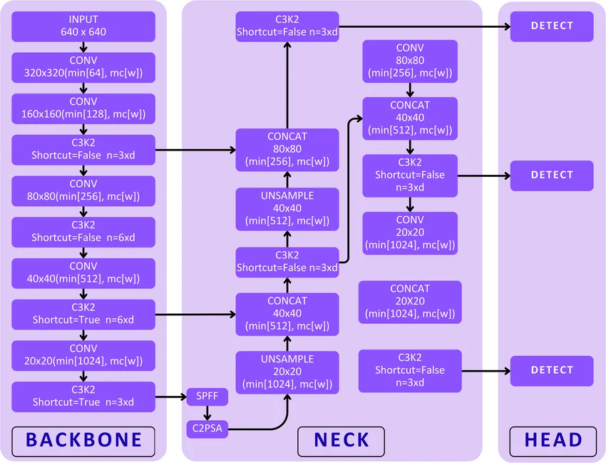
</p>
---

# 18. Training عمیق‌تر: Epoch، Batch، Iteration، Optimizer و Learning Rate

از جلسه اول:

```text
Forward
   ↓
Loss
   ↓
Backpropagation
   ↓
Gradient
   ↓
Optimizer
   ↓
Weight Update
```

حالا اصطلاحات اجرایی را دقیق‌تر کنیم.

## Epoch

یک عبور کامل Dataset آموزشی.

## Batch

زیرمجموعه‌ای از Train Data که در یک Step پردازش می‌شود.

مثلا:

```text
Train images = 3200
Batch size   = 32
```

تقریبا:

```text
100 batches per epoch
```

## Iteration / Step

معمولا یک Update Weight بعد از پردازش یک Batch.

پس:

```text
1 Epoch = many Iterations
```

## Optimizer

Gradient می‌گوید تغییر پارامتر در چه جهتی Loss را تغییر می‌دهد. Optimizer تصمیم می‌گیرد Weightها چگونه Update شوند.

نمونه‌ها:

- SGD
- SGD + Momentum
- Adam
- AdamW

## Learning Rate

Step Size یادگیری است.

خیلی بزرگ:

```text
Overshoot / Oscillation / Divergence
```

خیلی کوچک:

```text
Slow convergence
```

## Early Stopping و Patience

اگر Metric هدف برای چند Epoch بهتر نشود، Training متوقف می‌شود.

مثلا:

```python
model.train(
    data="data.yaml",
    epochs=100,
    patience=20,
)
```

## آیا هر 10 یا 20 Epoch دقیقا یک نوع Feature یاد گرفته می‌شود؟

 یک تقسیم شهودی از Epochها ثبت شده است: اول لبه، بعد شکل، بعد Feature و سپس Generalization.

این تصویر برای توضیح سلسله‌مراتب Feature مفید است، ولی نباید به عنوان قانون زمانی Training در نظر گرفته شود.

> **هیچ قانون عمومی وجود ندارد که بگوید مثلا Epoch 1 تا 10 فقط لبه و Epoch 11 تا 30 فقط شکل یاد گرفته می‌شود.** Featureها به صورت هم‌زمان و پویا با Optimizer، Data و Architecture تغییر می‌کنند.

---

# 19. Preprocess، Process، Postprocess و DataLoader

یک Pipeline ساده Inference:

```text
Raw Image
   ↓
Preprocess
   ↓
Tensor
   ↓
Neural Network
   ↓
Raw Predictions
   ↓
Postprocess
   ↓
Final Detections
```

## Preprocess

ممکن است شامل این موارد باشد:

- Resize / Letterbox؛
- RGB conversion؛
- Normalization؛
- Tensor conversion؛
- Batch dimension.

## Process

Forward Pass شبکه.

## Postprocess

- Confidence Threshold؛
- NMS یا روش متناظر معماری؛
- تبدیل Coordinate به Image Space؛
- رسم Box و Label.

## DataLoader

در Training، DataLoader مسئول رساندن Batchها به Model است.

یک تشبیه خوب:

> DataLoader مثل آشپز کمکی است. وقتی GPU روی Batch فعلی کار می‌کند، CPU می‌تواند Batch بعدی را بخواند، Decode کند و آماده کند تا GPU منتظر نماند.

پارامتر `workers` به Parallel Data Loading کمک می‌کند، ولی بیشتر بودن همیشه بهتر نیست. Storage، CPU، RAM، OS و حجم Transformها روی مقدار مناسب اثر دارند.

---

# 20. Resize، Letterbox و تعداد کانال‌ها

## چرا imgsz داریم؟

شبکه برای Batch Processing به Shape سازگار نیاز دارد. مقدار `imgsz=640` در بسیاری از مثال‌های YOLO رایج است، ولی عدد مقدس نیست.

```python
model.train(
    data="data.yaml",
    imgsz=640,
)
```

برای سرعت بیشتر ممکن است `320` یا `416` را تست کنید، ولی Objectهای کوچک ممکن است آسیب ببینند.

## مشکل Resize مستقیم

```text
1920×1080
   ↓ direct resize
640×640
```

Aspect Ratio تغییر می‌کند و Object کشیده می‌شود.

## Letterbox

Aspect Ratio را حفظ می‌کند و Padding اضافه می‌کند.

```python
import cv2

img = cv2.imread("test.jpg")
h, w = img.shape[:2]

target = 640
scale = target / max(h, w)

new_w = int(w * scale)
new_h = int(h * scale)

resized = cv2.resize(img, (new_w, new_h))

top = (target - new_h) // 2
bottom = target - new_h - top
left = (target - new_w) // 2
right = target - new_w - left

padded = cv2.copyMakeBorder(
    resized,
    top,
    bottom,
    left,
    right,
    cv2.BORDER_CONSTANT,
    value=(114, 114, 114),
)

cv2.imwrite("letterbox.jpg", padded)
```

<p align="center">
  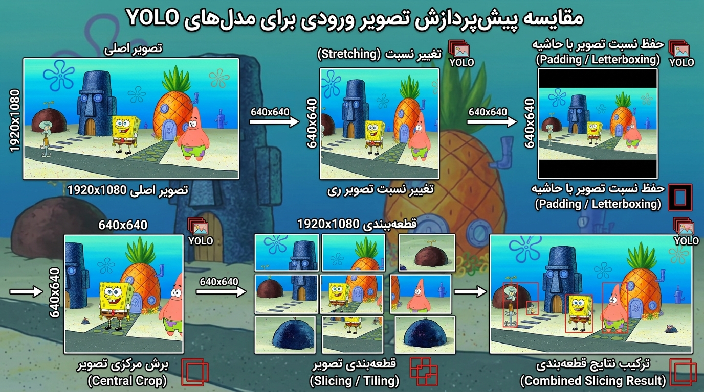
</p>

## سه کانال یا یک کانال؟

RGB سه Channel دارد. X-ray یا Thermal ممکن است ذاتا تک‌Channel باشد.

برای Dataset رنگی معمولی، کم‌کردن کانال ورودی معمولا بهترین روش Optimization نیست. Weightهای Pretrained متداول با ورودی سه‌کاناله ساخته شده‌اند.

دو مسیر داریم:

1. Grayscale را به سه Channel تکرار کنیم و Compatibility مدل Pretrained را نگه داریم؛
2. Architecture را واقعا برای یک Channel تغییر دهیم و Weightهای ورودی را متناسب سازگار یا Train کنیم.

برای کاهش Compute اغلب این کارها عملی‌ترند:

- مدل کوچک‌تر؛
- `imgsz` کمتر؛
- FP16؛
- Quantization؛
- Runtime بهینه؛
- TensorRT روی سخت‌افزار سازگار.

---

# 21. ارزیابی مدل: TP، TN، FP، FN، Precision، Recall و mAP

## چهار حالت پایه

فرض کنید Class مورد نظر `person` است.

### True Positive — TP

شخص وجود دارد و Model درست Detect می‌کند.

### False Positive — FP

شخص وجود ندارد ولی Model=Person اعلام می‌کند.

### False Negative — FN

شخص وجود دارد ولی Model آن را از دست می‌دهد.

### True Negative — TN

شیء هدف وجود ندارد و Model نیز مثبت اعلام نمی‌کند.

در Object Detection، تعریف Match بین Prediction و Ground Truth به IoU و Assignment هم وابسته است، ولی این چهار مفهوم همچنان پایه فهم Metrics هستند.

<p align="center">
  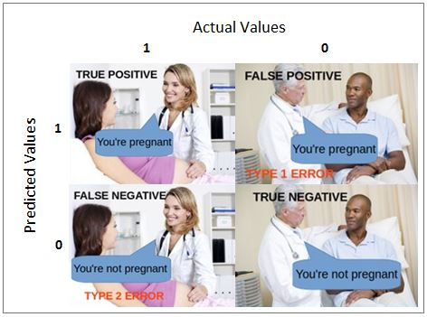
</p>

## Precision

```text
Precision = TP / (TP + FP)
```

پرسش:

> از چیزهایی که Model مثبت اعلام کرده، چند درصد واقعا درست بوده‌اند؟

## Recall

```text
Recall = TP / (TP + FN)
```

پرسش:

> از تمام Targetهای واقعی، چند درصد پیدا شده‌اند؟

## مثال

اگر:

```text
TP = 90
FP = 10
FN = 30
```

آنگاه:

```text
Precision = 90 / 100 = 0.90
Recall    = 90 / 120 = 0.75
```

## Trade-off با Confidence Threshold

اغلب:

```text
Confidence threshold ↑
→ Prediction کمتر
→ Precision ممکن است ↑
→ Recall ممکن است ↓
```

و برعکس.

این رابطه مطلق نیست، ولی شهود خوبی برای Tuning است.

## کجا Recall مهم‌تر است؟

اگر Miss کردن Target هزینه بالایی دارد.

مثلا یک سیستم هشدار ایمنی ممکن است Recall بالا بخواهد.

## کجا Precision مهم‌تر است؟

اگر False Alarm هزینه زیادی دارد.

مثلا یک سیستم اتوماتیک که بعد از Detection اقدام پرهزینه‌ای انجام می‌دهد، ممکن است به Precision بالا نیاز داشته باشد.

> [!NOTE]
> این انتخاب به Domain و Risk Analysis بستگی دارد. پزشکی، ایمنی و کاربردهای حساس را نمی‌توان با یک قانون ساده «Precision همیشه مهم‌تر» یا «Recall همیشه مهم‌تر» خلاصه کرد.

## F1 Score

وقتی می‌خواهیم تعادلی بین Precision و Recall ببینیم:

```text
F1 = 2 × (Precision × Recall) / (Precision + Recall)
```

## IoU

```text
IoU = Intersection Area / Union Area
```

## AP و mAP

**AP** خلاصه‌ای از Precision-Recall برای یک Class است.

**mAP** میانگین AP روی Classها است.

### mAP50

IoU Threshold = 0.50.

### mAP50-95

AP روی Thresholdهای زیر محاسبه و میانگین گرفته می‌شود:

```text
0.50, 0.55, 0.60, ..., 0.95
```

این Metric سخت‌گیرانه‌تر است.

---

# 22. تمرین تکمیلی: آموزش مدل 

## Dataset خوب چه ویژگی‌ای دارد؟

صرفا «عکس زیاد» کافی نیست. Dataset باید تنوع مسئله واقعی را پوشش دهد:

- زاویه‌های مختلف
- نورهای مختلف
- Backgroundهای مختلف
- فاصله و Scale مختلف
- Occlusion
- دوربین‌های مختلف
- نمونه‌های مثبت و منفی مناسب

اگر تمام عکس‌ها در یک اتاق و یک زاویه باشند، مدل ممکن است به جای خود Object، Background را Shortcut یاد بگیرد.

## یک نکته تکمیلی مهم

برای مدل خوب فقط Training کافی نیست. بعد از Training این سؤال‌ها را جواب بدهید:

```text
کدام Class بیشترین FN را دارد؟
کدام Scene بیشترین FP را می‌سازد؟
Object کوچک مشکل دارد یا بزرگ؟
شب مشکل داریم یا روز؟
آیا یک Background خاص Model را گول می‌زند؟
```

این مرحله **Error Analysis** است و از زیادکردن کورکورانه Epoch مهم‌تر است.

---

# 23. خواندن خروجی هر Epoch و نمودارهای Training

یکی از هدف‌های اصلی جلسه دوم این است که Terminal را مثل یک متن معنی‌دار بخوانیم، نه مثل یک عالمه عدد.

یک خروجی نمونه:

```text
Epoch    GPU_mem   box_loss   cls_loss   dfl_loss   Instances   Size
12/50      3.21G      1.042      0.583      0.921        24      640

Class   Images   Instances   Box(P)      R      mAP50   mAP50-95
all        150         410      0.842   0.771    0.812      0.634
```

## Epoch

```text
12/50
```

یعنی Epoch دوازدهم از پنجاه.

## GPU_mem

مصرف VRAM در آن مرحله.

اگر Out Of Memory بگیرید، یکی از اولین پارامترهایی که باید کم شود Batch است.

## box_loss

خطای Localization / Regression Box.

## cls_loss

خطای Classification.

## dfl_loss

**Distribution Focal Loss** برای Bounding Box Regression استفاده می‌شود و به نمایش توزیعی فاصله مرزهای Box کمک می‌کند.

> [!IMPORTANT]
>`dfl_loss` به عنوان معیار تشخیص Edge ثبت شده گفته می‌شود. ارتباط آن با دقیق‌تر شدن مرز Box قابل فهم است، ولی DFL یک Edge Detector مثل Canny نیست. این یک Loss برای Box Regression است.

## Instances

تعداد Objectهای موجود در Batch فعلی.

این عدد با `batch` یکی نیست. یک Image ممکن است صفر، یک یا ده Object داشته باشد.

## Size

اندازه ورودی Training.

## Box(P)

Precision.

## R

Recall.

## mAP50 و mAP50-95

Metrics بخش قبلی.

## روند سالم چه شکلی است؟

در حالت کلی انتظار داریم:

```text
Training losses ↓
Validation metrics ↑ سپس plateau
```

اما Curveها همیشه صاف نیستند. نوسان طبیعی است.

### علامت Overfitting

ممکن است:

```text
Train Loss ↓
Validation performance ↓ یا ثابت
```

### علامت Underfitting

هم Train و هم Validation ضعیف‌اند و مدل هنوز Pattern کافی نگرفته است.

## فقط یک عدد را نگاه نکنید

ممکن است mAP خوب باشد ولی یک Class خاص Recall افتضاح داشته باشد.

همیشه بررسی کنید:

- Per-class metrics؛
- Confusion Matrix؛
- PR Curve؛
- Predictionهای واقعی؛
- Worst-case Samples.

<p align="center">
  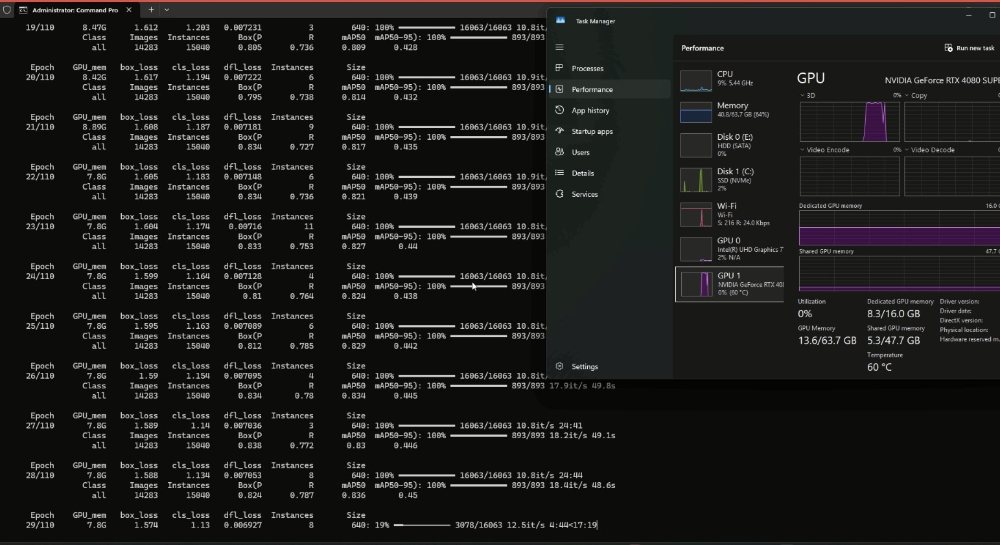
  Sample traning on my system
</p>


<p align="center">
  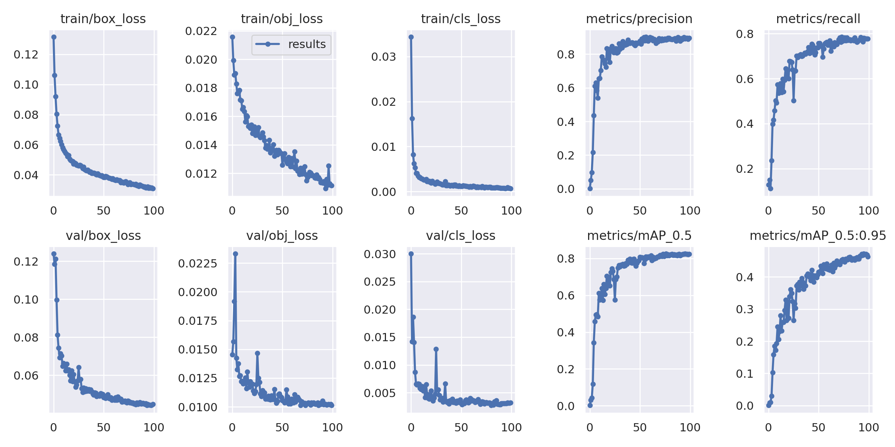
yolo-results
</p>

<p align="center">
  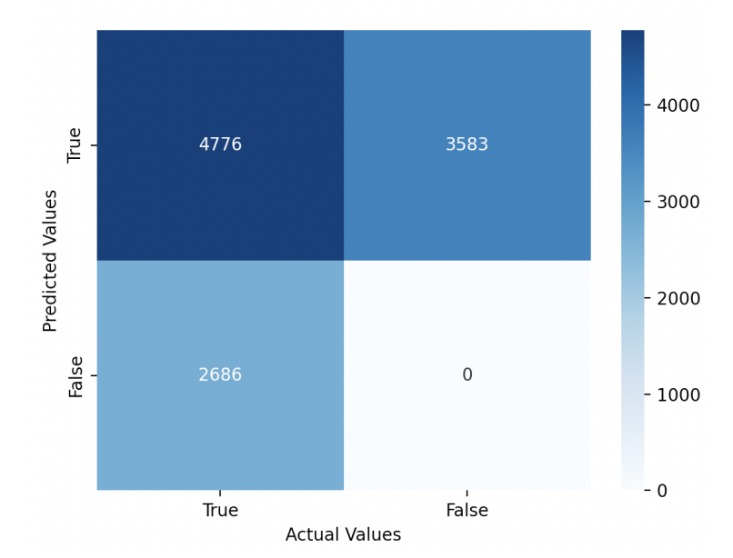
  confusion-matrix-run
</p>


# 24. نصب PyTorch، CUDA و Ultralytics

سه ابزار نقش متفاوت دارند:

## OpenCV

- Camera I/O؛
- Image Processing؛
- Video؛
- رسم و نمایش.

## PyTorch

- Tensor؛
- GPU compute؛
- Autograd؛
- Backpropagation؛
- Neural Network layers.

## Ultralytics

یک API سطح بالاتر برای Training، Validation، Prediction، Tracking و Export خانواده مدل‌های پشتیبانی‌شده فراهم می‌کند.

## بررسی NVIDIA GPU

```bash
nvidia-smi
```

اگر GPU NVIDIA و Driver مناسب دارید، جدول GPU دیده می‌شود.

> [!IMPORTANT]
> عدد CUDA که `nvidia-smi` نشان می‌دهد لزوما همان Package Runtime نصب‌شده داخل Python Environment نیست. برای نصب PyTorch دستور رسمی متناسب با OS و GPU را از صفحه رسمی PyTorch بگیرید.

## نصب عمومی Packageها

```bash
pip install ultralytics opencv-python numpy matplotlib pandas scikit-learn
```

برای PyTorch GPU:

```text
https://pytorch.org/get-started/locally/
```

از Selector رسمی دستور مناسب را بردارید.

## تست

```python
import torch
from ultralytics import YOLO

print("Torch:", torch.__version__)
print("CUDA available:", torch.cuda.is_available())

if torch.cuda.is_available():
    print("GPU:", torch.cuda.get_device_name(0))

model = YOLO("yolov8n.pt")
print("Model loaded")
```

## Training CLI

```bash
yolo detect train data=data.yaml model=yolov8n.pt epochs=50 imgsz=640 batch=8
```

## Training با Python

```python
from ultralytics import YOLO

model = YOLO("yolov8n.pt")

model.train(
    data="data.yaml",
    epochs=50,
    imgsz=640,
    batch=8,
)
```
> [!NOTE]
> بگذارید تا اندکی صادقانه بگویم، خودم در این کد train شدن مدل، نکات مهمی رو یاد گرفتم. مثلا اخیرا فهمیدم می‌شه یه کد پشتیبان از جنس batchScript ویندوز یا sh لینوکس ساخت که اونها، فایل پایتون رو اجرا کنند و محدودیت‌های سخت افزاری بذارن و موجب نشه وسط آموزش، کرش بکنه سیستم یا failed بشه کل کار. این چیزا، با تمرین و رفتن توی دل پروژه به دست میاد و یاد می‌گیرینشون. 
> اگه دوست داشتین، بهم ایمیل بزنید که براتون نمونه فایل‌های پشتیبان و محافظ اجرای train رو بفرستم تا داشته باشین.
---

# 25. تنظیم سخت‌افزار: Batch، Workers، Device و Memory

## Batch

بزرگ‌تر شدن Batch معمولا VRAM بیشتری می‌خواهد.

```text
Batch ↑ → VRAM ↑
```

اما «بزرگ‌ترین Batch ممکن همیشه بهترین» نیست. Batch روی Dynamics آموزش هم اثر دارد.

برای شروع آموزشی:

```text
GPU ضعیف → 4 یا 8
GPU متوسط → 8 یا 16
```

و بر اساس VRAM تنظیم کنید.

## Device

```python
model.train(device=0)
```

اولین GPU.

```python
model.train(device="cpu")
```

CPU.

در Multi-GPU تنظیمات به نسخه Framework و API وابسته است.

## Workers

Workers مربوط به Data Loading است.

```text
workers = 0, 2, 4, 8, ...
```

عدد مناسب را با Benchmark پیدا کنید. بله، خیلی جدی با آزمون و خطا و فهمیدن پتانسیل سیستم خودتان. از تجربه و استانداردهایی که llm ها پیشنهاد می‌دهند، الهام بگیرید، ولی همیشه درست نیستند.

اگر Storage کند باشد، Workers بیشتر ممکن است کمک کند. اگر RAM کم باشد یا Windows multiprocessing مشکل ایجاد کند، Workers کمتر ممکن است پایدارتر باشد.

## ImgSize

```text
imgsz ↑
→ جزئیات بیشتر
→ Compute بیشتر
→ Memory بیشتر
```

برای Tiny Object گاهی Resolution بیشتر ارزش دارد.

## Patience

```python
model.train(patience=15)
```

اگر Metric برای مدت مشخصی بهتر نشود، Early Stopping فعال می‌شود.

## یک روش عملی برای Tuning

```text
1. مدل Nano
2. imgsz=640
3. batch کم
4. Train کوتاه
5. Memory و Speed را ببین
6. batch را بالا ببر
7. اگر Object کوچک است imgsz را تست کن
8. بعد سراغ مدل بزرگ‌تر برو
```

---

# 26. پروژه عملی ۱: ردیاب بادکنک و Gimbal Control

هدف:

> Detection یک بادکنک در Video و تولید Error Signal برای حرکت Camera/Gimbal تا Object نزدیک مرکز Frame بماند.

Pipeline:

```text
Camera
  ↓
YOLO Detection
  ↓
Best Balloon Box
  ↓
Box Center
  ↓
Frame Center
  ↓
Error X, Error Y
  ↓
Controller
  ↓
Pan / Tilt Motor
```

## محاسبه Center Error

```python
def center_error(box_xyxy, frame_width, frame_height):
    x1, y1, x2, y2 = box_xyxy

    object_x = (x1 + x2) / 2.0
    object_y = (y1 + y2) / 2.0

    frame_x = frame_width / 2.0
    frame_y = frame_height / 2.0

    error_x = object_x - frame_x
    error_y = object_y - frame_y

    return error_x, error_y
```

اگر:

```text
error_x > 0 → Object سمت راست است
error_x < 0 → Object سمت چپ است
```

برای جلوگیری از لرزش موتور، Dead Zone تعریف کنید:

```python
def command_from_error(error_x, error_y, dead_zone=20):
    command_x = 0
    command_y = 0

    if error_x > dead_zone:
        command_x = 1
    elif error_x < -dead_zone:
        command_x = -1

    if error_y > dead_zone:
        command_y = 1
    elif error_y < -dead_zone:
        command_y = -1

    return command_x, command_y
```

## Distance Estimation ساده

اگر عرض واقعی Object و Focal Length کالیبره‌شده را بدانیم:

```text
Distance ≈ Real Width × Focal Length / Pixel Width
```

این روش برای Object با اندازه واقعی ثابت و Camera کالیبره‌شده معنی دارد.

> [!WARNING]
> فقط از کوچک‌تر شدن Box نمی‌توان Distance دقیق عمومی استخراج کرد. Pose، Perspective و اندازه واقعی Object مهم‌اند.

<p align="center">
  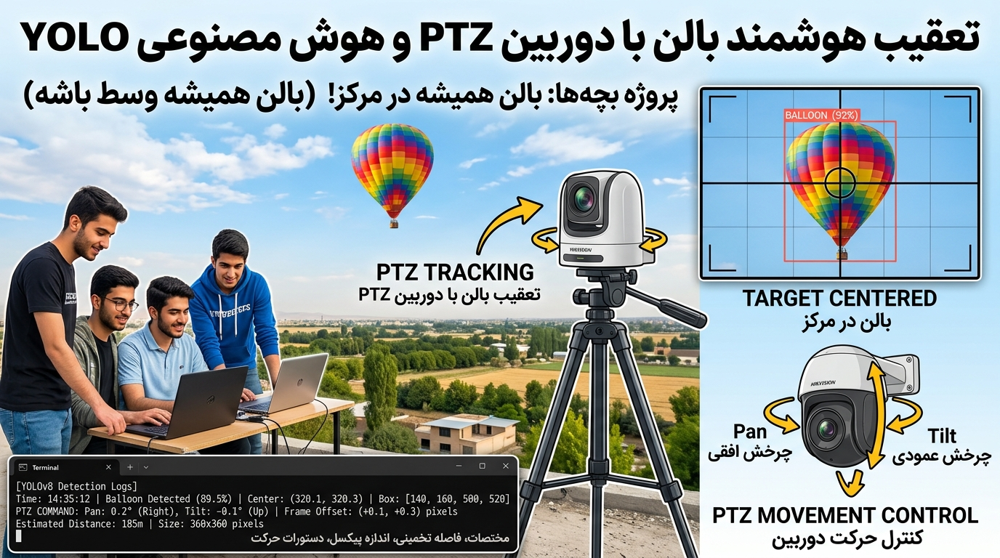
</p>
---

# 27. پروژه عملی ۲: هشدار عبور از خط زرد مترو

هدف:

> تشخیص Person و هشدار هنگام ورود به محدوده خطر.

یک راه ساده:

```text
Person Detection
    ↓
Bottom Center of Box
    ↓
Danger Zone Test
    ↓
Alert
```

## چرا Bottom Center؟

برای Person، Bottom Center Bounding Box معمولا تخمین ساده‌ای از نقطه تماس فرد با زمین است.

```python
def bottom_center(box_xyxy):
    x1, y1, x2, y2 = box_xyxy
    return ((x1 + x2) / 2.0, y2)
```

ولی در تصویر Perspective، خط خطر شاید افقی نباشد. بهتر است Zone به شکل Polygon تعریف شود.

## Polygon Zone

```python
import cv2
import numpy as np

zone = np.array([
    [100, 500],
    [900, 420],
    [1200, 700],
    [50, 700],
], dtype=np.int32)

point = (640, 560)

inside = cv2.pointPolygonTest(zone, point, False) >= 0
print("Inside danger zone:", inside)
```
<p align="center">
  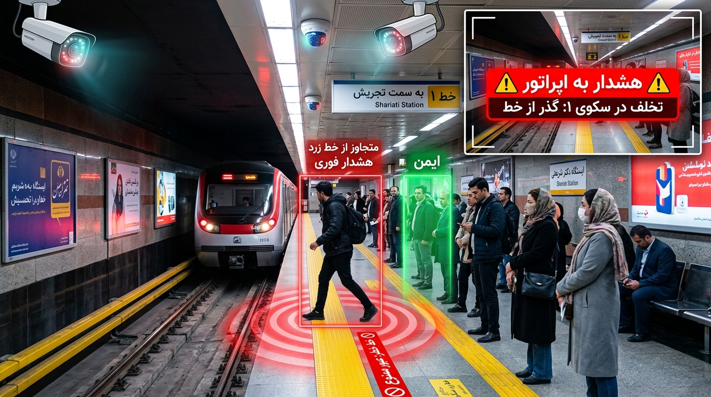
</p>


## آیا YOLO لازم است؟

این پرسش عمدی است.

اگر فقط Motion در یک Region مهم است، Background Subtraction شاید ساده‌تر باشد. ولی اگر می‌خواهید فقط **انسان** باعث Alert شود، Detection ارزش بیشتری پیدا می‌کند.

این پروژه مثال خوبی برای Trade-off است.

<p align="center">
  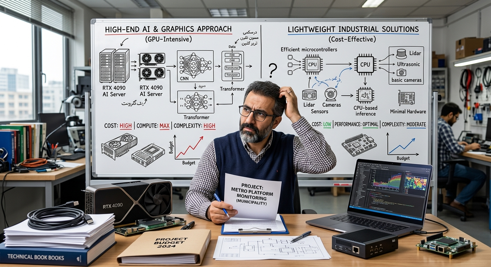
  بهتر است اینگونه بگویم که بعد از این کلاس، سریعا به فکر نیوفتید که مشکلات عالم را با دانش حداکثری خود حل کنید!
  به بهینه‌ترین راه فکر کنید. ما درس می‌خوانیم که مشکلات را حل کنیم. به جیب مشتری و شرایط بازار هم توجه داشته باشید. این پروژه را بهتر است بدون مدل و با light curtain مانند سنسورهای درب آسانسور حل کنید و به فکر بینایی و خطای آن، نباشید.
  ساده نگاه کنید و خارج از باکس!
</p>

---

# 28. پروژه عملی ۳: Line Crossing و Tracking با ByteTrack

Detection به تنهایی ID ندارد.

اگر Person در ده Frame دیده شود، ده Detection داریم. Tracking تلاش می‌کند بگوید:

```text
Frame 1 → Person ID 7
Frame 2 → Person ID 7
Frame 3 → Person ID 7
```

نمونه:

```python
from ultralytics import YOLO

model = YOLO("yolov8n.pt")

results = model.track(
    source=0,
    classes=[0],
    tracker="bytetrack.yaml",
    show=True,
)
```

برای Line Crossing Counter باید State هر ID را نگه داریم:

```text
ID 7: previous side = left
ID 7: current side  = right
→ crossing event
```

## چرا Tracking مهم است؟

بدون ID ممکن است یک Person را در هر Frame دوباره Count کنید.

<p align="center">
  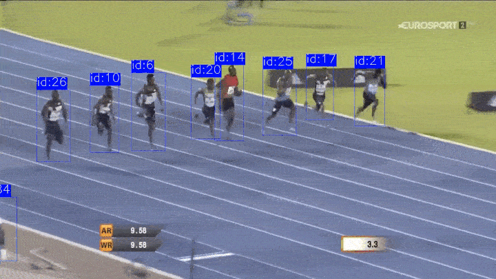
</p>

---

# 29. پروژه پیشنهادی: Face / Emotion و ملاحظات داده

در جزوه یک مثال برای Emotion / Face Detection آمده بود که از نظر Workflow ارزش زیادی دارد.

قبل از Train:

1. آیا Model آماده وجود دارد؟
2. آیا Dataset مناسب وجود دارد؟
3. Dataset چه License دارد؟
4. آیا Consent لازم وجود دارد؟
5. Label Emotion چقدر Subjective است؟
6. Classها Balanced هستند؟
7. آیا Domain Bias داریم؟

Emotion Recognition مثال خوبی است که نشان می‌دهد «داشتن Image و Label» به تنهایی کافی نیست. تعریف Ground Truth ممکن است خودش مبهم باشد.

برای پروژه‌های چهره باید حریم خصوصی، رضایت، Bias و کاربرد نهایی جدی گرفته شود.

---

# 30. TensorRT، Export و Deployment

Training پایان پروژه نیست.

Model باید در محیط هدف اجرا شود.

ممکن است Target شما باشد:

- PC؛
- NVIDIA GPU؛
- Jetson؛
- Edge Device؛
- Backend Server؛
- Unity Application؛
- XR Pipeline.

## TensorRT چیست؟

TensorRT یک Runtime و Optimization Toolkit از NVIDIA برای Inference روی سخت‌افزار NVIDIA است.

در Workflow مناسب می‌تواند:

- Graph Optimization؛
- FP16؛
- INT8 در شرایط مناسب؛
- Kernel Optimization

را برای Inference سریع‌تر فراهم کند.

در Ultralytics می‌توانید Export را بسته به Version و Environment انجام دهید. نمونه مفهومی:

```python
from ultralytics import YOLO

model = YOLO("best.pt")
model.export(format="engine")
```

> [!NOTE]
> Export به TensorRT به Environment سازگار NVIDIA/TensorRT نیاز دارد. قبل از Deployment، Accuracy بعد از Export را دوباره Validation کنید.

## برای XR چه می‌شود؟

یکی از Pipelineهای ممکن:

```text
Camera Feed
   ↓
Inference Service / Local Model
   ↓
Detection / Pose
   ↓
Coordinate Conversion
   ↓
Unity / Unreal
   ↓
Interaction or Overlay
```

Latency اینجا حیاتی است. Model عالی با 500 ms Delay ممکن است برای Interaction بلادرنگ مناسب نباشد.

---

# 31. مدیریت Dataset تیمی و Google Sheet

جزوه جلسه روی این بخش تاکید خوبی داشت. در پروژه تیمی باید بدانیم چه Data داریم، کجا است و چه وضعیتی دارد.

ستون‌های پیشنهادی:

| ستون | توضیح |
|---|---|
| ID | شماره Dataset یا Batch |
| Dataset Name | نام |
| Owner | مسئول |
| Source URL | منبع |
| Local/Drive Path | محل ذخیره |
| License | مجوز |
| Size | حجم |
| Images | تعداد تصاویر |
| Objects | تعداد Labelها |
| Classes | کلاس‌ها |
| Annotation Format | YOLO / COCO / VOC / Seg |
| Status | Raw / Cleaning / Labeling / QA / Ready |
| Split Status | Train / Val / Test آماده؟ |
| Quality Score | ارزیابی داخلی |
| Known Issues | مشکل‌ها |
| Version | v1 / v2 / v3 |
| Notes | توضیحات |

## درباره Quality Score

در جزوه پیشنهاد شده بود Datasetهای با Score بالاتر را بیشتر وارد Train کنیم. این کار باید با احتیاط انجام شود.

Score بهتر است ابتدا برای:

- اولویت QA؛
- حذف Data خراب؛
- شناخت Domain Coverage؛
- تصمیم Collect More Data

استفاده شود.

اگر Sampling Weight را بر اساس Score تغییر دهید، ممکن است Distribution واقعی را تغییر دهید. این تصمیم باید آگاهانه باشد.

## Versioning

هیچ وقت Raw Data را بدون Backup تغییر ندهید.

```text
data_raw/
dataset_v1/
dataset_v2_clean/
dataset_v3_aug_policy/
```

بهتر است بدانید هر Model با کدام Dataset Version Train شده است.

---
# 32. اشتباه‌های رایج و Troubleshooting

## CUDA available = False

```python
import torch
print(torch.cuda.is_available())
```

بررسی کنید:

- NVIDIA GPU دارید؟
- Driver درست است؟
- PyTorch GPU build نصب شده؟
- Environment درست فعال است؟

## CUDA Out of Memory

راهکار:

- Batch کمتر؛
- ImgSize کمتر؛
- Model کوچک‌تر؛
- برنامه‌های GPU دیگر را ببندید.

## Training خیلی کند است

بررسی کنید:

- CPU bottleneck؛
- HDD کند؛
- workers؛
- GPU usage؛
- Image decoding؛
- Augmentation سنگین.

## Loss NaN شد

ممکن است:

- Label خراب؛
- Learning Rate نامناسب؛
- Numeric instability؛
- Data مشکل‌دار

باشد.

Dataset Audit را اجرا کنید.

## mAP بالا ولی خروجی واقعی بد است

احتمال‌ها:

- Leakage؛
- Validation آسان؛
- Domain Shift؛
- Metric متوسط Classها مشکل یک Class را پنهان کرده؛
- Threshold Deployment با Validation فرق دارد.

## Train خوب، Val بد

Overfitting محتمل است.

راهکار:

- Data بیشتر؛
- Augmentation مناسب؛
- Model کوچک‌تر؛
- Early Stopping؛
- Regularization؛
- Leakage Check؛
- Label Check.

## Boxها جابه‌جا هستند

احتمال:

- Format اشتباه؛
- Pixel vs Normalized confusion؛
- Width/Height جابه‌جا؛
- Resize بدون Transform Label.

## Class ID اشتباه

مثلا:

```yaml
names:
  0: cat
  1: dog
```

ولی Labelها با Mapping دیگری ساخته شده‌اند.

## Model فقط Background را یاد گرفته

اگر Classها همیشه با Background خاص همراه باشند، Shortcut Learning ممکن است رخ دهد.

راهکار:

- Background diversity؛
- Negative samples؛
- Cross-domain validation.

---

# 33. واژه‌نامه جلسه دوم

| فارسی | English | معنی |
|---|---|---|
| برچسب‌گذاری | Annotation | ساخت Ground Truth |
| کادر مرزی | Bounding Box | مستطیل دور Object |
| کادر چرخیده | Oriented Bounding Box | Box دارای زاویه |
| چندضلعی | Polygon | مرز چندنقطه‌ای |
| نقطه کلیدی | Keypoint | Landmark مهم |
| فرمت پاسکال | Pascal VOC | Annotation کلاسیک XML |
| فرمت COCO | COCO Format | JSON annotation |
| فرمت YOLO | YOLO Format | txt normalized labels |
| نرمال‌سازی | Normalization | تبدیل به مقیاس نسبی |
| مجموعه داده | Dataset | Data + Label |
| نشت داده | Data Leakage | آلودگی Splitها |
| آموزش | Training | Update Weight |
| اعتبارسنجی | Validation | ارزیابی حین توسعه |
| آزمون | Test | ارزیابی نهایی |
| اعتبارسنجی متقاطع | K-Fold Cross Validation | چند Split چرخشی مستقل |
| افزایش داده | Data Augmentation | ساخت تنوع مصنوعی |
| ستون فقرات | Backbone | Feature Extractor |
| گردن | Neck | Feature Fusion |
| سر | Head | Prediction Layer |
| دوره | Epoch | یک عبور کامل Train Set |
| دسته | Batch | گروه Sampleها در یک Step |
| گام | Iteration / Step | یک Update Training |
| نرخ یادگیری | Learning Rate | اندازه Update |
| بهینه‌ساز | Optimizer | الگوریتم Update Weight |
| توقف زودهنگام | Early Stopping | توقف بدون بهبود |
| صبر | Patience | بازه انتظار Early Stop |
| پیش‌پردازش | Preprocess | آماده‌سازی Input |
| پس‌پردازش | Postprocess | فیلتر و تبدیل Output |
| بارگذار داده | DataLoader | Batch Loading |
| تغییر اندازه Letterbox | Letterbox Resize | حفظ Aspect Ratio با Padding |
| مثبت درست | True Positive | تشخیص مثبت درست |
| مثبت کاذب | False Positive | هشدار اشتباه |
| منفی کاذب | False Negative | Target از دست رفته |
| دقت مثبت | Precision | TP/(TP+FP) |
| بازخوانی | Recall | TP/(TP+FN) |
| امتیاز F1 | F1 Score | تعادل P/R |
| هم‌پوشانی | IoU | Intersection/Union |
| میانگین دقت | mAP | میانگین AP |
| خطای کادر | Box Loss | Localization loss |
| خطای کلاس | Class Loss | Classification loss |
| خطای توزیعی | DFL Loss | Distribution-based bbox loss |
| ردیابی | Tracking | حفظ ID در Frameها |
| استقرار | Deployment | اجرای Model در محصول |
| زمان پاسخ | Latency | تاخیر Inference |

---

# 34. منابع پیشنهادی

## Ultralytics

```text
https://docs.ultralytics.com/
```

## PyTorch

```text
https://pytorch.org/get-started/locally/
https://docs.pytorch.org/tutorials/
```

## OpenCV

```text
https://docs.opencv.org/
```

## CVAT

```text
https://docs.cvat.ai/
```

## Label Studio

```text
https://labelstud.io/
```

## Roboflow

```text
https://roboflow.com/
https://universe.roboflow.com/
```

## Dataset Search

```text
https://datasetsearch.research.google.com/
```

## Kaggle

```text
https://www.kaggle.com/datasets
```

## Hugging Face Datasets

```text
https://huggingface.co/datasets
```

## COCO

```text
https://cocodataset.org/
```

## Google Open Images

```text
https://storage.googleapis.com/openimages/web/index.html
```

---

# 35. جمع‌بندی نهایی

در جلسه اول تلاش کردیم بفهمیم Machine Vision از کجا آمده، Pixel چیست، Feature چیست، شبکه عصبی چگونه Weightها را اصلاح می‌کند و YOLO چگونه Detection انجام می‌دهد.

جلسه دوم قرار است این فهم را وارد زمین واقعی پروژه کند.

اگر بخواهم کل Session 2 را در چند جمله جمع کنم:

این چرخه را چند بار که با دست خودتان انجام بدهید، خیلی از اسم‌های ترسناک این حوزه تبدیل می‌شوند به قطعه‌های قابل فهم یک سیستم مهندسی.

---

**علی نجارزادگان**  
درس‌نامه جلسه دوم آشنایی با بینایی ماشین — ویژه دانشجویان XR  
شهریور ۱۴۰۵

ان شاءالله مفید واقع بشیم.  
اگر جایی از این درس‌نامه بهتر می‌شود، خوشحال می‌شوم Issue یا PR ثبت کنید.  
مهم‌تر از خواندنش، اجراش کنید، خرابش کنید و دوباره بهتر بسازید. 🌱
